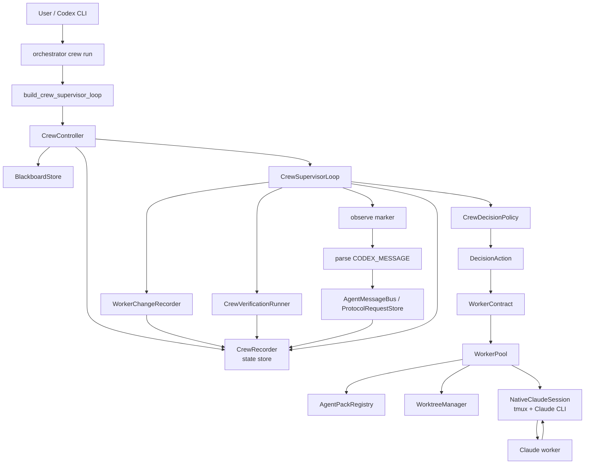
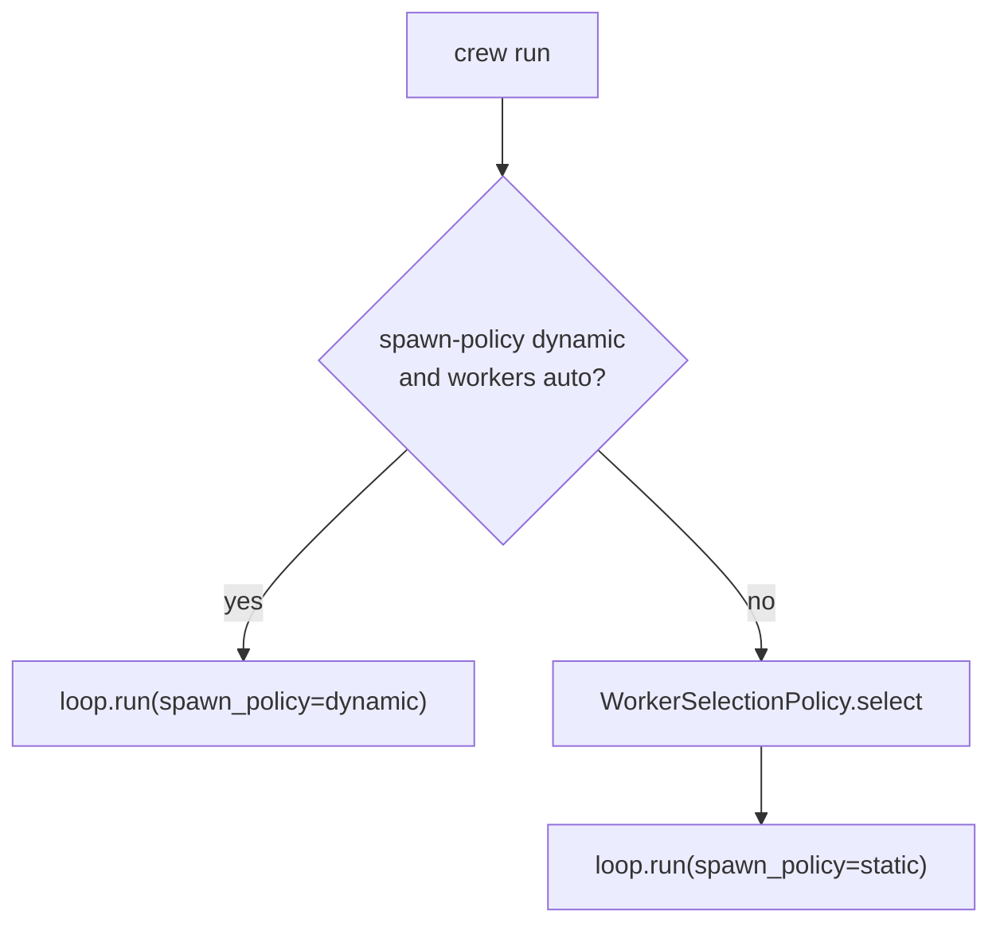
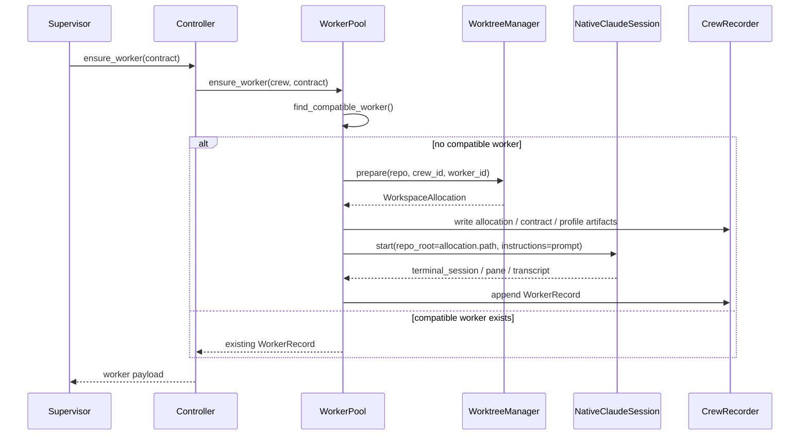
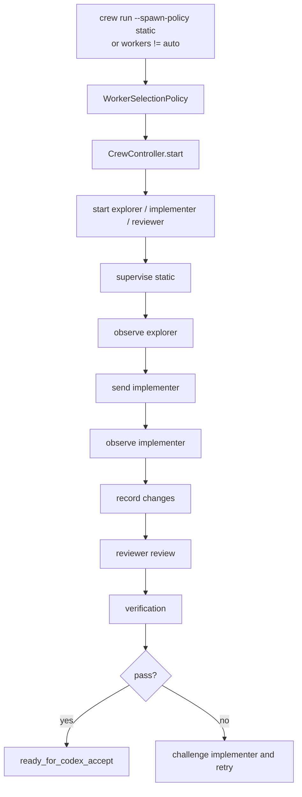
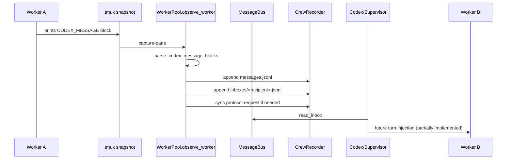
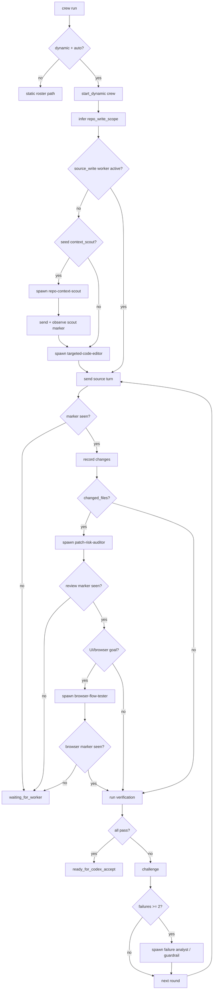

# Dynamic Agent Orchestrator 当前架构说明

日期：2026-04-30
状态：当前实现说明，供方案评审使用
范围：`codex_claude_orchestrator` 中 Codex-managed Claude crew 的 dynamic worker contract 方案

## 1. 一句话总结

当前系统的核心设计是：

```text
Codex 做控制平面，Claude Code worker 做执行平面。
Codex 不预先固定 explorer / implementer / reviewer 三件套，
而是在运行过程中根据目标、证据、diff、verification 失败和 worker 状态动态生成 WorkerContract，
再由 WorkerPool 启动或复用 Claude CLI worker。
```

这不是一个“Claude 自己组队、自主协作到底”的系统。它更接近一个 **Codex-mediated agent crew runtime**：

- Codex 负责创建 crew、生成 contract、启动 worker、观察 marker、记录证据、运行验证、challenge、accept。
- Claude worker 只在 contract 范围内执行具体任务。
- worker 之间不直接互相操控；通信必须通过 Codex 解析、记录、路由。
- 所有状态、transcript、diff、verification output、decision、message 都落盘，方便审计和恢复。

## 2. 当前目标

原始目标来自：

```text
docs/superpowers/specs/2026-04-30-dynamic-agent-role-pack-design.zh.md
```

目标是把 V3 crew 从“静态 roster / 固定角色”升级为“运行时动态生成 worker contract”的控制平面。

更具体地说，系统要支持：

1. `crew run` 默认不再无脑启动 explorer / implementer / reviewer。
2. Codex 根据当前 need frame 决定是否需要 scout、source editor、reviewer、browser tester、failure analyst、guardrail maintainer。
3. worker 的核心身份不是 enum role，而是 `WorkerContract`。
4. contract 中显式声明 capability、authority、workspace policy、write scope、expected outputs、acceptance criteria、protocol refs。
5. Claude worker 用 tmux 承载，可观察、可 attach、可 stop。
6. source-write worker 默认使用 git worktree。
7. verification 由 Codex control plane 运行，结果写入 artifacts 和 blackboard。
8. 所有关键行为可审计、可重放、可恢复。

### 2.1 参考内容如何进入当前设计

当前架构不是凭空设计出来的，它吸收了四类参考：

1. CCteam-creator 的 team lead / role pack / team snapshot / review protocol 思路。
2. learn-claude-code 的 subagent、task system、JSONL inbox、team protocol、worktree isolation 思路。
3. 本地 Hermes Agent runtime 的 event envelope、artifact reference、tool context、context compression 思路。
4. Claude Code source / best practice 中成熟的 task lifecycle、subagent task、team config、message tool、worktree enter/exit 设计。

这些参考没有被直接复制。当前实现只引入与 Codex-managed Claude worker runtime 匹配的部分，并保留 Codex 作为外层控制平面。

总体映射关系：

| 参考来源 | 借鉴内容 | 当前落点 |
|---|---|---|
| CCteam-creator | team lead 负责全局协调 | Codex / `CrewSupervisorLoop` 是 team lead |
| CCteam-creator | role 不是固定三件套，而是按任务组合 | `WorkerContract.label` + `required_capabilities` |
| CCteam-creator | team snapshot 便于 resume | `team_snapshot.json` |
| CCteam-creator | review dimensions / BLOCK-WARN-OK | `patch-risk-auditor` contract，后续需严格解析 verdict |
| learn-claude-code s04 | subagent 用干净上下文执行 | 每个 worker 是独立 Claude CLI tmux session |
| learn-claude-code s07 | 任务状态落盘 | `tasks.json` + `CrewTaskRecord` |
| learn-claude-code s09 | JSONL inbox | `messages.jsonl` + `inboxes/*.jsonl` |
| learn-claude-code s10 | request/response FSM | `ProtocolRequestStore` |
| learn-claude-code s12 | worktree 与任务绑定 | `WorkspaceAllocation` + `WorktreeManager` |
| Hermes Agent | event envelope | `CrewEvent`，目前主要用于 worker observation |
| Hermes Agent | 大输出落盘，用 artifact refs 传递 | transcript、diff、verification stdout/stderr artifacts |
| Hermes Agent | verification 绑定同一 task/workspace context | `CrewVerificationRunner` 在 worker workspace cwd 下运行 |
| Claude Code source | terminal task status / killed / stopped 概念 | `WorkerStatus` + terminal status helper |
| Claude Code source | long-running agent 可 attach/tail/stop | `NativeClaudeSession` + worker CLI |
| Claude Code source | worktree 安全退出 / keep-remove 策略 | `WorktreeManager.cleanup(remove=...)` |

### 2.2 CCteam-creator 参考内容

CCteam-creator 主要提供的是 agent team 的组织方式，而不是某个具体代码实现。

它给当前设计的启发：

#### 2.2.1 Team lead 思路

CCteam-creator 中的主会话是 `team-lead`。team lead 不只是 dispatcher，它负责：

- 用户目标对齐。
- 任务范围控制。
- 阶段门禁。
- 团队规则。
- 全局文件和进度维护。
- 判断是否需要某个角色。

当前系统把这个职责放到 Codex control plane：

```text
CCteam team-lead
  -> 当前系统中的 Codex + CrewSupervisorLoop + CrewDecisionPolicy
```

这样做的原因是：

- Codex 可以看到 orchestrator 状态、worktree、verification、artifacts。
- Codex 可以 stop/attach/tail worker。
- Codex 可以把 worker 输出转成 audit trail。
- Claude worker 不需要知道整个控制平面。

当前实现中的对应点：

- `CrewSupervisorLoop` 负责每一轮推进。
- `CrewDecisionPolicy` 负责决定 spawn 哪种 worker。
- `CrewController` 负责把决策落实为 runtime 操作。
- `CrewRecorder` 负责把 team 状态落盘。

#### 2.2.2 Role pack 拆成 capability / protocol pack

CCteam-creator 提供 backend-dev、frontend-dev、researcher、e2e-tester、reviewer、custodian 等角色参考。

当前设计没有照搬这些角色名，而是把它们拆成两个层面：

```text
Capability
  worker 能做什么，例如 inspect_code / edit_source / review_patch / browser_e2e

Protocol
  worker 应该如何协作，例如 task_confirmation / review_dimensions / three_strike_escalation
```

原因：

- 固定 role 还是容易退化成新三件套。
- 真实任务需要更细的能力组合。
- 同一个 worker 可以同时具备多个能力。
- 不同 contract 可以复用同一组 capability fragments。

当前实现中的对应点：

- `WorkerContract.required_capabilities`
- `WorkerContract.protocol_refs`
- `AgentPackRegistry.capability_fragments_for(...)`
- `AgentPackRegistry.protocol_fragments_for(...)`
- `AgentProfile.render_prompt()`

示例：

```text
targeted-code-editor
  capabilities:
    inspect_code
    edit_source
    edit_tests
    run_verification
  protocols:
    task_confirmation
    doc_code_sync

patch-risk-auditor
  capabilities:
    review_patch
    inspect_code
  protocols:
    review_dimensions
```

#### 2.2.3 Team snapshot

CCteam-creator 的 `team-snapshot.md` 保存 team 状态、onboarding prompt 和技能信息，方便恢复团队上下文。

当前实现改成 JSON：

```text
.orchestrator/crews/<crew_id>/team_snapshot.json
```

原因：

- JSON 更适合测试。
- JSON 更容易被 CLI 输出。
- JSON 更容易被未来 resume command 使用。
- 完整 prompt 本身仍保存在 artifacts 中，不需要塞进 snapshot。

当前 `team_snapshot.json` 包含：

- `crew_id`
- capability registry version
- decision policy version
- created contracts
- spawned workers
- message cursor summary
- open protocol requests
- prompt artifacts
- last decision
- resume hint

#### 2.2.4 Review protocol

CCteam-creator 强调 reviewer 不是“总结者”，而是 calibrated evaluator。reviewer 应该能给出：

```text
OK
WARN
BLOCK
```

并按 review dimensions 检查 correctness、regression、API risk、missing tests。

当前实现已经引入：

- `patch-risk-auditor` contract。
- `review_dimensions` protocol ref。
- changed files / diff artifact 传给 auditor。

但当前还没有严格解析 reviewer verdict。这在本文档后面被列为 P0 缺口。

#### 2.2.5 没有照搬 CCteam-creator 的部分

没有照搬：

- 不复制 `.plans/` 目录结构。
- 不复制完整 skill prompt。
- 不让 skill 管 tmux/worktree/process lifecycle。
- 不把 role list 固化到 orchestrator core。
- 不让 Claude team lead 自己控制系统生命周期。

保留 Codex control plane 的原因：

```text
tmux session / git worktree / verification / cleanup / dirty base
这些是 runtime core，不应由 prompt 层 skill 自由处理。
```

### 2.3 learn-claude-code 参考内容

learn-claude-code 对当前设计影响最大的是通信、任务状态和 worktree isolation。

#### 2.3.1 s04 Subagents：干净上下文

learn-claude-code 强调 subagent 用干净上下文执行，父 agent 只接收摘要，避免主上下文被大量工具输出污染。

当前系统对应设计：

- 每个 worker 是一个独立 Claude CLI tmux session。
- worker 有自己的 transcript artifact。
- worker prompt 由 `AgentProfile` 单独渲染。
- Codex 不把所有 transcript 原文塞回下一轮，只保留 artifact refs、blackboard、summary。

这能减少上下文污染，也方便单独 stop/attach/tail。

#### 2.3.2 s07 Task System：任务图落盘

learn-claude-code 的 task system 强调 task 状态和依赖比临时 todo 更可靠。

当前系统保留：

- `CrewTaskRecord`
- `tasks.json`
- `task_for_contract(...)`
- task status：pending / assigned / running / submitted / challenged / accepted / rejected / blocked

dynamic path 中 task 不再来自固定 role graph，而是由 contract 生成：

```text
WorkerContract -> CrewTaskRecord
```

这样可以保留 task tracking，又不受固定 role 限制。

#### 2.3.3 s09 Agent Teams：JSONL inbox

learn-claude-code 的 agent team 用 roster/status 和 JSONL inbox 进行通信。

当前系统借鉴了 JSONL inbox，但做了两点修改：

1. 总线是 append-only。
2. 每个 recipient 用 cursor 表示已读位置。

状态文件：

```text
messages.jsonl
message_cursors.json
inboxes/<recipient>.jsonl
```

这样比 drain-on-read 更适合 audit 和 resume。

#### 2.3.4 s10 Team Protocols：request/response FSM

learn-claude-code 中 team protocol 不是自由聊天，而是 request/response + request_id + FSM。

当前实现对应：

- `ProtocolRequest`
- `ProtocolRequestStatus`
- `ProtocolRequestStore`

当前状态机：

```text
pending -> approved
pending -> rejected
pending -> expired
pending -> cancelled
```

terminal status 不能继续转移。

这为后续 plan approval、write scope approval、shutdown request、handoff ack 提供基础。

#### 2.3.5 s11 Autonomous Agents：从 idle 恢复

learn-claude-code 提到 idle agent 可以轮询 inbox 和任务板，从 idle 恢复到 working。

当前实现没有做 worker 自己轮询 inbox。

采纳方式是更保守的：

```text
Codex 在下一次 send_worker 前读取 inbox，
把必要 digest 注入 worker turn。
```

这还没有完全产品化，但方向是 Codex-mediated，而不是 worker 自己在后台乱跑。

#### 2.3.6 s12 Worktree Isolation：任务与 worktree 绑定

learn-claude-code 强调任务和 worktree 显式绑定，生命周期事件写 JSONL，崩溃后可恢复现场。

当前实现对应：

- `WorkspaceAllocation`
- `workspace_allocation_artifact`
- `WorktreeManager.prepare(...)`
- `WorktreeManager.cleanup(...)`
- `WorkerRecord.workspace_path`
- `WorkerRecord.workspace_mode`
- `WorkerChangeRecorder.record_changes(...)`

每个 source-write worker 的 worktree、branch、base ref 都会记录到 artifact。

### 2.4 Hermes Agent 参考内容

本地 Hermes Agent runtime 对当前设计的影响主要是 runtime envelope 和 artifact discipline。

#### 2.4.1 Turn observation envelope

Hermes 的 agent loop 会记录每轮工具调用、reasoning、tool errors、finished naturally 等 envelope 信息。

当前系统初步采纳为：

- `CrewEvent`
- `worker_turn_observed`
- `marker_seen`
- `artifact_refs`
- `reason`
- `payload`

目前 event envelope 还不完整，主要覆盖 observe worker。长期应该把 spawn、send、verify、challenge、stop、accept 都统一成 event。

#### 2.4.2 ToolContext / verification context

Hermes 中 verifier 可以访问 rollout 使用过的同一个 task/tool context。

当前系统的对应设计是：

```text
verification 默认在 source worker 的 workspace_path 中运行。
```

也就是：

- source worker 在 worktree 修改代码。
- verification 在同一个 worktree cwd 执行。
- stdout/stderr 写回同一个 crew artifacts。

这避免了“worker 改 A 环境，Codex 在 B 环境验证”的错位。

#### 2.4.3 Artifact reference by default

Hermes 对大工具输出做落盘和引用，避免上下文爆炸。

当前系统对应：

- transcript 落盘：`workers/<worker_id>/transcript.txt`
- diff 落盘：`workers/<worker_id>/diff.patch`
- changes 落盘：`workers/<worker_id>/changes.json`
- verification stdout/stderr 落盘：`verification/<id>/stdout.txt`
- prompt/profile 落盘：`onboarding_prompt.md`, `agent_profile.md`

Codex 和 worker 后续应该优先传 artifact ref，而不是全文注入。

#### 2.4.4 Context compression / active instruction fence

Hermes 的 ContextEngine 区分 active instruction 和 reference summary，避免旧摘要被模型当作新命令。

当前系统还没有完整 compression engine，但在设计中有两个落点：

- `team_snapshot.json` 用作 resume reference。
- 未来 inbox digest / resume prompt 应该明确区分“历史参考”和“当前指令”。

这是 message routing 产品化时必须注意的边界。

#### 2.4.5 没有照搬 Hermes 的部分

没有照搬：

- 不把 verification 变成任意 reward function。
- 不引入长期 gateway daemon。
- 不引入跨平台消息网关。
- 不把所有工具调用迁移到 Hermes loop。

当前仍然以 Claude CLI + tmux 为 execution substrate。

### 2.5 Claude Code Source / Best Practice 参考内容

Claude Code source 对当前设计的影响主要是生命周期、task、message、worktree 安全退出。

#### 2.5.1 Task status / terminal status

Claude Code 的 task model 明确区分 pending、running、completed、failed、killed，并提供 terminal status 判断。

当前系统对应：

- `WorkerStatus`
- `CrewTaskStatus`
- `is_terminal_worker_status(...)`
- `is_terminal_task_status(...)`

这用于避免给 dead worker 发消息，避免重复清理，避免把 stopped worker 当成 active worker。

#### 2.5.2 QueryEngine：持久多 turn session

Claude Code 的 QueryEngine 是一会话多 turn 的持久对象。

当前系统对应思想：

- worker tmux session 是持久的。
- `send_worker()` 只是注入下一轮消息。
- worker transcript 保留历史。
- `turn_marker` 区分每一轮完成信号。

当前不足：

- supervisor 本身不是长期 daemon。
- compact/microcompact/token budget continuation 没有实现。

#### 2.5.3 LocalAgentTask / pending messages

Claude Code 的 local agent task 会在安全边界注入 pending messages，完成后用 task notification 返回结果。

当前系统计划对应：

```text
message bus -> inbox digest -> send_worker next turn
```

目前已实现 message parse/store/inbox，还没有稳定注入 digest。

#### 2.5.4 SendMessageTool / structured messages

Claude Code 的 message tool 支持普通消息、broadcast、shutdown request/response、plan approval response 等结构化类型。

当前系统对应：

- `AgentMessageType`
- `ProtocolRequest`
- `CODEX_MESSAGE` transcript block

但当前不让 worker 直接调用外部 message tool，而是让 Codex 从 transcript 中解析结构化块。

原因：

- Claude CLI worker 已经在 tmux 中运行，transcript 是最小接入面。
- Codex 可以审计和拒绝消息。
- 不需要在 worker 环境里额外安装 tool。

#### 2.5.5 TeamCreateTool / team config

Claude Code 的 team create 会保存 team lead、成员、session、cwd、tmux pane、worktree、permission mode。

当前系统对应：

- `crew.json`
- `workers.jsonl`
- `team_snapshot.json`
- worker allocation artifact
- worker transcript artifact
- contract artifact

相比 team config，当前 state store 更偏 append-only audit，而不是单一 mutable config。

#### 2.5.6 EnterWorktree / ExitWorktree

Claude Code 的 worktree 工具重点是安全退出：keep/remove、dirty check、恢复 cwd、清缓存、tmux 收尾。

当前系统对应：

- `WorktreeManager.cleanup(remove=False)` 默认 keep。
- `remove=True` 时 dirty worktree 拒绝删除。
- `worker stop --workspace-cleanup keep|remove`。

当前不足：

- 没有完整恢复 cwd 概念，因为 worker 是独立 tmux session。
- 没有清理工具缓存。
- 没有 merge 后自动 remove 策略。

#### 2.5.7 没有照搬 Claude Code experimental teams

没有照搬：

- 不直接使用 Claude Code 内部 TeamCreate / SendMessage 作为 orchestrator core。
- 不依赖 experimental swarm feature flag。
- 不让 worker 自己 enter/exit worktree 或创建团队。

原因：

```text
当前系统要的是 Codex-first control plane。
Claude Code 是 worker execution substrate，不是外层 orchestrator。
```

### 2.6 参考内容带来的三条硬约束

综合这些参考，当前架构确立了三条硬约束。

#### 2.6.1 Event envelope first

每个关键动作都应该可记录为事件：

```text
worker turn
tool/progress observation
message route
verification
challenge
stop
accept
```

事件至少包含：

```text
event_id
crew_id
worker_id
contract_id
type
status
artifact_refs
reason
created_at
```

当前实现还没有让所有动作都走 event，但 `CrewEvent` 已经是这个方向的基础。

#### 2.6.2 Artifact reference by default

大输出必须落盘，后续上下文只传摘要和引用。

包括：

```text
transcript
diff
verification output
review output
mailbox large body
onboarding prompt
agent profile
```

这是为了控制上下文污染，也为了审计。

#### 2.6.3 Safe lifecycle gates

所有高风险生命周期动作都必须有 gate：

```text
stop -> 检查 worker/session 状态
remove worktree -> 检查 dirty
accept -> verification evidence
merge -> diff/scope/conflict check
message route -> Codex 可审计/可拒绝
```

当前已实现部分 gate：

- dirty base gate。
- verification command policy gate。
- dirty worktree remove gate。
- terminal protocol request gate。

还未实现或不完整：

- write scope runtime gate。
- review verdict gate。
- merge gate。
- message route approval gate。

## 3. 非目标

当前实现刻意没有做这些事：

- 不让 Claude worker 自己创建新 worker。
- 不让 worker 直接互相写 tmux / shell / worktree。
- 不让 worker 绕过 Codex 执行 accept / merge / cleanup。
- 不依赖 Claude Code experimental team/swarm 功能。
- 不把所有判断交给一个自由 prompt agent。
- 不做完全自动 merge 到主工作区。
- 不把 `write_scope` 当成真实文件系统 sandbox；目前它主要是 contract/prompt 级约束。

这些非目标很重要，因为它们决定了当前系统是 **可控的半自动 crew**，不是完全自治 agent swarm。

## 4. 顶层架构



系统可以按六层理解：

| 层 | 作用 | 代表模块 |
|---|---|---|
| CLI 层 | 命令入口、参数解析、默认策略选择 | `cli.py` |
| Control Plane | crew 生命周期、worker 生命周期、verify/challenge/accept 封装 | `crew/controller.py` |
| Supervisor Loop | 主状态机：spawn、send、observe、changes、review、verify、challenge | `crew/supervisor_loop.py` |
| Decision Policy | 根据 snapshot 生成下一步 `DecisionAction` | `crew/decision_policy.py` |
| Worker Runtime | worktree、Claude tmux session、prompt/profile、worker reuse | `workers/pool.py`, `runtime/native_claude_session.py`, `workspace/worktree_manager.py` |
| State / Evidence | JSON/JSONL 状态、blackboard、events、artifacts、messages | `state/crew_recorder.py`, `state/blackboard.py`, `messaging/message_bus.py` |

## 5. 关键模块职责

### 5.1 `cli.py`

`cli.py` 是用户入口。

当前 `crew run` 的重要默认值：

```text
--spawn-policy dynamic
--workers auto
--mode auto
--max-rounds 3
--poll-interval 5.0
```

当满足：

```text
args.spawn_policy == "dynamic" and args.workers == "auto"
```

CLI 会调用：

```python
loop.run(
    repo_root=repo_root,
    goal=args.goal,
    verification_commands=args.verification_command,
    max_rounds=args.max_rounds,
    poll_interval_seconds=args.poll_interval,
    allow_dirty_base=args.allow_dirty_base,
    spawn_policy="dynamic",
    seed_contract=args.seed_contract,
)
```

否则会回退到 static roster 路径，由 `WorkerSelectionPolicy` 选择固定 worker roles。

### 5.2 `CrewController`

`CrewController` 是 control-plane facade。它不直接做 policy，也不直接跑 git diff，而是把底层能力封装成稳定操作：

- `start()`：静态 crew 启动，按固定 roles 创建 tasks 和 workers。
- `start_dynamic()`：动态 crew 启动，只创建 crew 记录，不预先创建 worker。
- `ensure_worker()`：给定 `WorkerContract`，复用或启动 worker。
- `send_worker()`：向 worker tmux pane 注入一轮消息。
- `observe_worker()`：读取 worker tmux pane，检查 marker，解析 `CODEX_MESSAGE`。
- `changes()`：记录 worker worktree 相对 base 的变更。
- `verify()`：在目标 worker worktree 下运行 verification command。
- `challenge()`：把失败或风险写入 blackboard。
- `accept()`：将 crew 标记为 accepted，并停止 worker。
- `stop()` / `stop_worker()`：停止 crew 或单个 worker。
- `write_team_snapshot()`：写 resume / audit 用的 team snapshot。
- `record_decision()`：把 policy 决策写入 `decisions.jsonl`。
- `append_known_pitfall()`：三次失败后记录 guardrail/pitfall。

`CrewController` 的定位类似一个应用服务层。上面是 supervisor，下面是 recorder、blackboard、worker pool、verification runner、change recorder、merge arbiter。

### 5.3 `CrewSupervisorLoop`

`CrewSupervisorLoop` 是核心运行时状态机。

它有两个路径：

1. `supervise()`：旧的静态 roster 路径。
2. `supervise_dynamic()`：新的 dynamic contract 路径。

动态路径当前执行的动作包括：

- 检查 verification command 是否存在。
- 构造 `CrewDecisionPolicy`。
- 推导 repo write scope。
- 检查当前是否已有 source-write worker。
- 如果没有，则通过 policy 生成 contract 并 spawn worker。
- 如果 seed 了 context scout，则先跑 readonly scout。
- 给 source worker 发 per-turn marker。
- 轮询 worker tmux pane，直到 marker 出现或超时。
- 记录 worker changes。
- 若有 changed files，按需创建 patch auditor。
- UI/browser 目标下，patch review 后按需创建 browser flow tester。
- 运行 verification。
- verification 全过则返回 `ready_for_codex_accept`。
- verification 失败则 challenge；连续失败时创建 failure analyst / guardrail maintainer。

当前动态路径是“按轮同步监督”。它不是长期 daemon，也不是 worker 自己 wake up 后继续跑。`crew run` 一次最多跑 `max_rounds` 轮。

### 5.4 `CrewDecisionPolicy`

`CrewDecisionPolicy` 是目前的调度大脑，但它还是 rule-based。

输入是一个 snapshot dict，典型字段：

```text
crew_id
goal
workers
changed_files
review_status
browser_check_status
verification_failures
verification_passed
context_insufficient
repo_write_scope
```

输出是 `DecisionAction`：

```text
SPAWN_WORKER
OBSERVE_WORKER
ACCEPT_READY
NEEDS_HUMAN
...
```

当前规则顺序：

1. 如果上下文不足，并且还没有具备 `design_architecture` 能力的 worker，则 spawn `repo-context-scout`。
2. 如果 verification 失败次数 >= 3，并且已有 `triage_failure` worker，但没有 `maintain_guardrails` worker，则 spawn `guardrail-maintainer`。
3. 如果 verification 失败次数 >= 2，并且还没有 `triage_failure` worker，则 spawn `verification-failure-analyst`。
4. 如果已有 changed files，但还没有 review 状态，并且没有 `review_patch` worker，则 spawn `patch-risk-auditor`。
5. 如果目标看起来是 UI/browser，并且 patch review ok，但还没有 browser check，则 spawn `browser-flow-tester`。
6. 如果 verification passed 且没有 blocking review，则 `ACCEPT_READY`。
7. 如果没有 source-write worker，则 spawn `targeted-code-editor`。
8. 否则 observe 已存在 source-write worker。

这个顺序很关键。它保证：

- failure escalation 比普通 source-write 更优先。
- review 在 verification 前插入。
- source-write worker 是最后兜底。

### 5.5 `WorkerPool`

`WorkerPool` 负责 worker runtime：

- 根据 task 或 contract 分配 workspace。
- 写 allocation artifact。
- 写 contract artifact。
- 组装 `AgentProfile` prompt。
- 写 onboarding prompt 和 agent profile artifact。
- 通过 `NativeClaudeSession.start()` 创建 tmux Claude CLI session。
- 记录 `WorkerRecord`。
- 查找 compatible worker，避免重复启动 worker。
- 发送 worker turn。
- 观察 worker turn。
- 解析 `CODEX_MESSAGE`。
- 记录 `CrewEvent`。
- stop worker / stop crew / prune orphan tmux sessions。

兼容 worker 的复用条件：

```text
worker 在 active_worker_ids 中
worker 不是 terminal status
worker capabilities 覆盖 contract.required_capabilities
worker authority_level 覆盖 contract.authority_level
worker workspace_mode 等于 contract 需要的 workspace mode
```

当前没有把 `write_scope` 纳入兼容性判断。这意味着一个已有 source-write worker 可能被复用到新的 source-write contract，即使新 contract 的 write scope 不完全一样。短期可接受，长期应改成兼容判断的一部分。

### 5.6 `NativeClaudeSession`

`NativeClaudeSession` 是 tmux + Claude CLI 的薄封装。

启动逻辑：

```text
tmux new-session -d -s <session> -c <workspace> -n claude
tmux send-keys -t <pane> "script -q <transcript> claude <initial_prompt>" C-m
```

发送一轮消息：

```text
<message>

When this turn is complete, print exactly: <turn_marker>
This turn marker overrides any earlier completion marker.
```

观察逻辑：

```text
tmux capture-pane -p -t <pane> -S -<lines>
marker_seen = marker in snapshot
```

这个设计简单直接，但也有脆弱性：如果 Claude 没有打印 marker，supervisor 无法判定 turn complete。

### 5.7 `WorktreeManager`

`WorktreeManager` 负责 git worktree 隔离。

创建 worktree 时：

1. 确认 `repo_root` 是 git repo。
2. 读取 `git status --porcelain`。
3. 如果 repo dirty 且没有 `allow_dirty_base`，抛 `DirtyWorktreeError`。
4. 记录 base ref：`git rev-parse HEAD`。
5. 创建 branch：`codex/<crew_id>-<worker_id>`。
6. 执行 `git worktree add -b <branch> <path> <base_ref>`。
7. 如果 dirty 且允许 dirty base：
   - 写 `dirty-base.patch` artifact。
   - 在 worker worktree 中 apply patch。
   - 复制未跟踪文件。
   - 写 untracked manifest。

记录 changes 时：

- tracked changes：`git diff --name-only <base_ref>`。
- untracked：`git ls-files --others --exclude-standard`。
- diff patch：`git diff --binary <base_ref>` + untracked no-index diff。

cleanup 时：

- 默认 keep。
- 如果 `remove=True`，先检查 worker worktree 是否 dirty。
- dirty 时拒绝删除。

### 5.8 `WorkerChangeRecorder`

`WorkerChangeRecorder` 把 worker worktree 中的变更固化成 artifacts：

```text
workers/<worker_id>/changes.json
workers/<worker_id>/diff.patch
```

并向 blackboard 写一条 `PATCH` entry：

```text
Worker <id> changed N file(s).
```

evidence refs 包括：

- changes.json
- diff.patch
- changed files

这使得 review worker、Codex、用户都可以查看同一份 diff 证据。

### 5.9 `CrewVerificationRunner`

`CrewVerificationRunner` 在指定 cwd 里运行 verification command。

关键点：

- command 用 `shlex.split()` 解析为 argv，不走 shell。
- 先通过 `PolicyGate.guard_command()` 拦截危险命令。
- 输出写入：
  - `verification/<verification_id>/stdout.txt`
  - `verification/<verification_id>/stderr.txt`
- blackboard 追加 `VERIFICATION` entry。
- payload 返回 passed / exit_code / summary / cwd / target_worker_id / artifacts。

最近补上的行为：

```text
如果 command 的第一个 token 是相对路径可执行文件，例如 .venv/bin/python，
并且 worker worktree 中不存在这个路径，
但主 repo 中存在 repo_root/.venv/bin/python，
则改用主 repo 的绝对路径运行。
```

这解决了 worker worktree 没有 `.venv/bin/python` 的问题。

### 5.10 `AgentMessageBus`

message bus 支持两类输入：

1. Codex 主动发送结构化 message。
2. 从 worker tmux snapshot 中解析 `CODEX_MESSAGE` block。

worker 可输出：

```text
<<<CODEX_MESSAGE
to: codex
type: question
requires_response: true
body:
  I need approval to edit tools/tests.
>>>
```

解析后会生成 `AgentMessage`：

```text
message_id
thread_id
request_id
crew_id
from
to
type
body
artifact_refs
requires_response
metadata
created_at
```

message 会写入：

```text
messages.jsonl
inboxes/<recipient>.jsonl
```

当前 message bus 已经能记录和读取 inbox，但“自动把 inbox digest 注入目标 worker 下一轮 prompt”还没有完全产品化。

### 5.11 `ProtocolRequestStore`

`ProtocolRequestStore` 管理需要状态转换的 request，例如：

- plan approval
- shutdown request
- write-scope request
- special verification request

状态机：

```text
pending -> approved
pending -> rejected
pending -> expired
pending -> cancelled
```

terminal request 不能继续 transition。

当前 protocol request 更像底层能力，尚未完全接入所有 supervisor 决策。

### 5.12 `CrewRecorder`

`CrewRecorder` 是所有状态的落盘中心。

它负责：

- 创建 crew dir。
- 写 `crew.json`。
- 写 latest crew id。
- append workers / contracts / events / decisions / messages / protocol requests / known pitfalls。
- 写 tasks。
- 写 blackboard。
- 写 text/json artifacts。
- 写 team snapshot。
- 读取完整 crew details。

状态采用 JSON + JSONL：

- JSON 用于当前状态。
- JSONL 用于 append-only event stream。

这套设计的优点是透明、简单、容易 debug。缺点是没有事务、并发写入保护较弱。

## 6. 核心数据模型

### 6.1 `CrewRecord`

表示一个 crew 的顶层状态。

重要字段：

```text
crew_id
root_goal
repo
status
max_workers
active_worker_ids
task_graph_path
blackboard_path
verification_summary
merge_summary
created_at
updated_at
ended_at
final_summary
```

状态枚举：

```text
planning
running
blocked
needs_human
accepted
failed
cancelled
```

### 6.2 `WorkerContract`

这是 dynamic design 的核心。

字段：

```text
contract_id
label
mission
required_capabilities
authority_level
workspace_policy
write_scope
context_refs
expected_outputs
acceptance_criteria
protocol_refs
communication_policy
completion_marker
max_turns
spawn_reason
stop_policy
created_at
```

它回答这些问题：

- 这个 worker 是谁？
- 为什么要创建？
- 它要完成什么 mission？
- 它需要什么能力？
- 它有多大权限？
- 它能写哪里？
- 它应该输出什么？
- 什么叫完成？
- 它应该遵循哪些 protocol？

### 6.3 `AgentProfile`

`AgentProfile = WorkerContract + capability fragments + protocol packs + project context + completion marker`

它最终渲染为 Claude worker 的 onboarding prompt。

prompt 中包含：

- Capability contract label
- Mission
- Capabilities
- Authority
- Workspace policy
- Write scope
- Context refs
- Expected outputs
- Acceptance criteria
- Capability fragments
- Protocol packs
- CODEX_MESSAGE 通信要求
- completion marker
- per-turn marker 覆盖规则

### 6.4 `WorkerRecord`

表示一个实际运行的 Claude worker。

重要字段：

```text
worker_id
crew_id
role
agent_profile
native_session_id
terminal_session
terminal_pane
transcript_artifact
turn_marker
workspace_mode
workspace_path
workspace_allocation_artifact
label
contract_id
capabilities
authority_level
write_scope
allowed_tools
status
assigned_task_ids
last_seen_at
created_at
updated_at
```

注意：`role` 仍存在，是为了兼容旧 task graph 和 static path。dynamic path 中真正有意义的是 `label`、`contract_id`、`capabilities`、`authority_level`。

### 6.5 `CrewEvent`

表示可审计事件。

字段：

```text
event_id
crew_id
worker_id
contract_id
type
status
artifact_refs
reason
payload
created_at
```

当前主要记录 worker observation：

```text
type = worker_turn_observed
status = completed | waiting
reason = marker seen | marker not seen
```

长期应该让 spawn、send、verify、challenge、stop、accept 也统一走 event envelope。

### 6.6 `BlackboardEntry`

blackboard 是 crew 的共享证据板。

entry type：

```text
fact
claim
question
risk
patch
verification
review
decision
```

当前用途：

- crew start 写 decision。
- spawn worker 写 decision。
- send_worker 写 decision。
- worker send result 写 claim。
- changes 写 patch。
- verification 写 verification。
- challenge 写 risk。

### 6.7 `DecisionAction`

policy 的输出。

action types 包括：

```text
spawn_worker
send_worker
observe_worker
route_message
request_protocol_response
record_changes
verify
challenge
request_independent_check
request_specialized_verification
accept_ready
needs_human
stop_worker
waiting
```

当前 dynamic loop 实际主要使用：

- `SPAWN_WORKER`
- `OBSERVE_WORKER`
- `ACCEPT_READY`

其他 action type 是为后续扩展保留。

### 6.8 `AgentMessage`

worker / Codex 之间的结构化消息。

message type：

```text
handoff
question
answer
plan_request
plan_response
shutdown_request
shutdown_response
evidence
status
```

当前已支持解析和落盘，但 routing 自动注入还不完整。

### 6.9 `ProtocolRequest`

表示需要审批或状态转换的协议请求。

字段：

```text
request_id
crew_id
type
from
to
status
subject
body
reason
artifact_refs
created_at
updated_at
```

状态：

```text
pending
approved
rejected
expired
cancelled
```

## 7. Dynamic Pipeline 详解

### 7.1 启动命令

典型命令：

```bash
.venv/bin/orchestrator crew run \
  --repo . \
  --goal "根据 docs/superpowers/specs/2026-04-30-dynamic-agent-role-pack-design.zh.md 实现代码" \
  --verification-command ".venv/bin/python -m pytest -q" \
  --allow-dirty-base
```

也可以 seed 一个 readonly context scout：

```bash
.venv/bin/orchestrator crew run \
  --repo . \
  --goal "..." \
  --verification-command ".venv/bin/python -m pytest -q" \
  --allow-dirty-base \
  --seed-contract context_scout
```

### 7.2 CLI 分派



当前默认就是 dynamic + auto，所以普通 `crew run` 会走动态路径。

### 7.3 创建 Dynamic Crew

`CrewController.start_dynamic()` 做这些事：

1. 生成 crew id。
2. 写 `crew.json`。
3. blackboard 记录 `Start dynamic crew for goal`。
4. 写空 `tasks.json`。
5. crew status 更新为 `running`。
6. 写 `team_snapshot.json`。

注意：这一步不会启动任何 worker。

### 7.4 Supervisor 初始化

`CrewSupervisorLoop.supervise_dynamic()` 初始化：

```text
policy = CrewDecisionPolicy()
events = []
verification_failures = []
repo_write_scope = _repo_write_scope(repo_root)
source_worker = _source_write_worker(current_status)
```

`repo_write_scope` 是最近补上的启发式，当前会识别：

```text
src/
tests/
test/
tools/
packages/
apps/
app/
lib/
scripts/
src/tests/
tools/tests/
packages/tests/
apps/tests/
...
```

如果一个 repo 只有 `tools/` 和 `tools/tests/`，生成 source-write contract 时会得到：

```json
["tools/", "tools/tests/"]
```

### 7.5 生成第一个 Contract

如果没有 source-write worker，policy 通常返回：

```text
DecisionActionType.SPAWN_WORKER
contract.label = targeted-code-editor
contract.required_capabilities = inspect_code, edit_source, edit_tests, run_verification
contract.authority_level = source_write
contract.workspace_policy = worktree
contract.write_scope = repo_write_scope
```

如果传了 `--seed-contract context_scout`，则先生成：

```text
repo-context-scout
authority = readonly
workspace_policy = readonly
capabilities = inspect_code, design_architecture
```

### 7.6 WorkerPool 启动 Worker



source-write worker 使用 worktree；readonly worker 通常可以用 readonly/shared workspace，具体由 `_workspace_mode_for_contract` 决定。

### 7.7 发送 Turn

Supervisor 为每一轮生成 per-turn marker：

```text
<<<CODEX_TURN_DONE crew=<crew_id> worker=<worker_id> phase=<phase> round=<n>>>
```

然后调用：

```text
controller.send_worker(..., turn_marker=marker)
```

`NativeClaudeSession.send()` 会把 marker 附加到消息后：

```text
When this turn is complete, print exactly: <marker>
This turn marker overrides any earlier completion marker.
```

这条覆盖规则是为了避免 onboarding prompt 里的 contract marker 和后续 per-turn marker 冲突。

### 7.8 观察 Worker

Supervisor 调用 `_wait_for_marker()`，每次：

```text
controller.observe_worker(lines=200, turn_marker=marker)
```

观察内容来自：

```text
tmux capture-pane -p -t <pane> -S -200
```

如果 marker 出现：

```text
marker_seen = true
event.status = completed
```

否则：

```text
marker_seen = false
event.status = waiting
```

如果超过最大观察次数仍没看到 marker，`crew run` 返回：

```json
{
  "status": "waiting_for_worker",
  "worker_id": "...",
  "events": [...]
}
```

这不是失败，而是 supervisor 没拿到 turn completion 信号。

### 7.9 记录 Changes

marker 出现后，source worker 进入 changes 阶段：

```text
controller.changes(crew_id, worker_id)
```

对 worktree worker：

- 用 base ref 计算 changed files。
- 生成 binary diff patch。
- 写 changes artifact。
- 写 diff artifact。
- blackboard 追加 patch entry。

返回示例：

```json
{
  "crew_id": "crew-...",
  "worker_id": "worker-...",
  "branch": "codex/crew-worker",
  "base_ref": "...",
  "changed_files": ["src/app.py", "tests/test_app.py"],
  "diff_artifact": "workers/worker-.../diff.patch",
  "artifact": "workers/worker-.../changes.json"
}
```

### 7.10 Patch Review

如果 `changed_files` 非空，policy 会尝试创建 `patch-risk-auditor`。

当前 review worker 会收到：

```text
Review the implementer patch.
Changed files: ...
Diff artifact: ...
```

review worker 完成后，目前 dynamic loop 直接把 `review_status = "ok"`。

这是 MVP 最大的简化之一。理想情况应该解析 reviewer 输出的：

```text
OK
WARN
BLOCK
```

并在 `BLOCK` 时阻止 verification/accept，回到 source worker 修复。

### 7.11 Browser Flow Test

如果 goal 中包含这些关键词：

```text
browser
ui
frontend
e2e
playwright
user flow
页面
前端
浏览器
用户流
```

并且 patch review ok，policy 会创建 `browser-flow-tester`。

当前 browser tester 是 readonly worker，负责报告浏览器/user flow 风险。它还没有真正绑定 Browser Use 或 Playwright 自动执行器，更多是 contract/prompt 层能力。

### 7.12 Verification

review/browser 后，Supervisor 执行每个 verification command：

```text
controller.verify(command=..., worker_id=source_worker_id)
```

`CrewController` 会解析目标 cwd：

```text
worker_id provided -> worker.workspace_path
worker_id missing -> implementer worker workspace_path or repo root
```

因此 source worker 的验证默认在 worker worktree 中跑。

verification runner 行为：

1. `shlex.split(command)`。
2. 解析 repo-relative executable。
3. `PolicyGate.guard_command(argv)`。
4. `subprocess.run(argv, cwd=verification_cwd, capture_output=True, text=True, timeout=120)`。
5. 写 stdout/stderr artifacts。
6. blackboard 追加 verification entry。
7. 返回 payload。

### 7.13 Accept / Challenge

如果所有 verification 结果 passed：

```text
status = ready_for_codex_accept
```

如果有失败：

1. 失败结果加入 `verification_failures`。
2. blackboard 写 challenge risk。
3. 如果失败次数 >= 2，policy 可能创建 `verification-failure-analyst`。
4. 如果失败次数 >= 3，policy 可能创建 `guardrail-maintainer`。
5. 如果超过 `max_rounds`，返回 `max_rounds_exhausted`。

## 8. Static Pipeline 对比

旧 static path 仍保留。



static path 适合：

- 想要稳定三角色工作流。
- 不想让 policy 动态 spawn 新 worker。
- 调试旧流程。

dynamic path 适合：

- 不确定需要哪些 worker。
- 希望少启动 worker。
- 希望失败后自动引入 analyst/guardrail。
- 希望 worker identity 按任务更精确。

## 9. 状态目录结构

每个 crew 都在：

```text
.orchestrator/crews/<crew_id>/
```

典型结构：

```text
crew.json
tasks.json
workers.jsonl
blackboard.jsonl
events.jsonl
decisions.jsonl
worker_contracts.jsonl
messages.jsonl
protocol_requests.jsonl
known_pitfalls.jsonl
message_cursors.json
team_snapshot.json
final_report.json
inboxes/
  codex.jsonl
  worker-xxx.jsonl
artifacts/
  contracts/
    <contract_id>.json
  workers/
    <worker_id>/
      allocation.json
      onboarding_prompt.md
      agent_profile.md
      transcript.txt
      changes.json
      diff.patch
      dirty-base.patch
      dirty-base-untracked-files.txt
  verification/
    <verification_id>/
      stdout.txt
      stderr.txt
```

文件含义：

| 文件 | 含义 |
|---|---|
| `crew.json` | crew 当前状态 |
| `tasks.json` | task graph / contract task 映射 |
| `workers.jsonl` | worker record append/update 后的记录 |
| `blackboard.jsonl` | Codex/worker 共享证据板 |
| `events.jsonl` | 观察和生命周期事件 |
| `decisions.jsonl` | policy 决策 |
| `worker_contracts.jsonl` | 动态创建过的 contract |
| `messages.jsonl` | 全量 message bus |
| `protocol_requests.jsonl` | protocol request 状态流 |
| `known_pitfalls.jsonl` | repeated failure 后的 guardrail 记录 |
| `team_snapshot.json` | resume / overview 用快照 |
| `artifacts/` | 大文本、prompt、diff、verification 输出 |

## 10. Dirty Base 策略

默认情况下，如果 repo dirty，worktree 创建会失败。

原因：

- worker worktree 基于 HEAD 创建。
- 如果主工作区有未提交改动，而 worker 没有这些改动，worker 看到的代码不等于用户当前代码。
- 这会导致 worker 做错上下文、verification 不一致、diff 难以合并。

如果传：

```text
--allow-dirty-base
```

则 `WorktreeManager` 会：

1. 记录当前 dirty patch。
2. 在新 worktree 中 apply 这个 patch。
3. 复制未跟踪文件。
4. 把 dirty-base patch 和 untracked manifest 写入 artifacts。

这使 worker 尽量看到与主工作区一致的基线。

风险：

- dirty patch apply 可能失败。
- 未跟踪目录复制只处理文件。
- 后续主工作区继续变化时，worker worktree 不会自动同步。
- dirty base 可能包含用户未想给 worker 的实验性改动。

因此 `--allow-dirty-base` 是显式 opt-in。

## 11. Marker 协议

当前 supervisor 判断 worker 完成一轮，依赖 marker。

存在两类 marker：

1. contract onboarding marker：

```text
<<<CODEX_TURN_DONE crew=<crew_id> contract=<contract_kind>>>
```

2. per-turn marker：

```text
<<<CODEX_TURN_DONE crew=<crew_id> worker=<worker_id> phase=<phase> round=<n>>>
```

实际 observe 使用 per-turn marker。

为避免冲突，当前 `NativeClaudeSession.send()` 会明确告诉 Claude：

```text
This turn marker overrides any earlier completion marker.
```

仍然存在的问题：

- Claude 可能长时间 thinking，不打印 marker。
- Claude 可能输出了相似但不完全相等的 marker。
- tmux capture 的窗口行数不足时可能看不到较早 marker。
- 如果 Claude 卡在权限确认或输入等待，supervisor 只能返回 `waiting_for_worker`。

可改进方向：

- loose marker detection。
- transcript 全文扫描。
- worker heartbeat。
- status command 识别 Claude 是否仍在运行。
- turn timeout 后自动 tail transcript 给 Codex。

## 12. Message / Protocol Pipeline

当前设计是 Codex-mediated mailbox：



当前已实现：

- 解析 `CODEX_MESSAGE`。
- 支持 `to/type/body/artifact_refs/thread_id/request_id/requires_response`。
- 写入 messages 和 inboxes。
- protocol request store。
- inbox cursor。

当前未完全实现：

- supervisor 自动读取 inbox 并注入目标 worker 下一轮。
- 对 message route 的 policy approval/rejection。
- plan approval / shutdown request 的完整用户交互。

## 13. Capability / Protocol Packs

`AgentPackRegistry` 提供内置 capability fragments 和 protocol fragments。

当前 contract 里只写 capability 名称：

```text
inspect_code
edit_source
edit_tests
run_verification
review_patch
browser_e2e
triage_failure
maintain_guardrails
design_architecture
```

WorkerPool 会把这些 capability 映射成 markdown fragment，拼进 AgentProfile prompt。

这样做的好处：

- contract 是结构化数据。
- prompt fragment 可以演化。
- 不需要把完整角色 prompt 写死在 policy 中。

风险：

- capability fragment 仍然是 prompt 约束，不能强制执行工具权限。
- 如果 fragment 过长，会增加 worker onboarding 噪声。
- 不同 capability 之间可能存在冲突，目前没有冲突检测。

## 14. 安全边界

### 14.1 命令安全

verification command 不走 shell，而是 `shlex.split()` 后用 argv 运行。

`PolicyGate` 会阻止：

- `rm -rf`
- `git reset --hard`
- `git clean -fd`
- 一些危险 wrapper / inline execution

这降低了 verification command 的破坏风险。

### 14.2 Workspace 安全

source-write worker 默认 worktree。

readonly worker 默认不应写源码，但当前主要靠 contract/prompt 约束。

worktree cleanup 默认 keep；remove 时如果 worktree dirty 会拒绝删除。

### 14.3 Dirty Repo 安全

没有 `--allow-dirty-base` 时，dirty repo 拒绝创建 worker worktree。

这曾经导致实际启动失败，但这个失败是有意的安全门。

### 14.4 审计安全

所有重要产物写入 artifacts：

- onboarding prompt
- agent profile
- transcript
- allocation
- contract
- changes
- diff
- verification stdout/stderr

这让失败可以复盘，而不是只依赖 Claude 的口头总结。

## 15. 当前已经实现的能力

### 15.1 Dynamic crew 默认入口

`crew run` 默认 dynamic。

### 15.2 Dynamic WorkerContract

已实现：

- source editor
- context scout
- patch auditor
- browser tester
- failure analyst
- guardrail maintainer

### 15.3 Worker profile / prompt pack

已实现：

- capability fragments
- protocol packs
- AgentProfile prompt 渲染
- onboarding prompt artifact
- agent profile artifact

### 15.4 Worktree worker

已实现：

- worktree 创建
- dirty base opt-in
- dirty patch artifact
- untracked copy
- branch fallback
- changed files
- diff patch
- safe cleanup

### 15.5 Supervisor dynamic loop

已实现：

- start dynamic crew
- policy decide
- ensure worker
- marker send/observe
- changes
- patch review worker
- browser worker trigger
- verification
- challenge
- failure analyst
- guardrail maintainer
- ready_for_codex_accept

### 15.6 Message / protocol base

已实现：

- `CODEX_MESSAGE` parser
- append-only message bus
- inbox files
- cursors
- protocol request store
- terminal transition protection

### 15.7 Verification runner

已实现：

- command policy gate
- cwd = worker worktree
- stdout/stderr artifact
- blackboard entry
- repo-relative executable fallback

### 15.8 State/read commands

CLI 支持查看：

- contracts
- messages
- inbox
- protocols
- decisions
- snapshot
- capabilities
- resume-context

## 16. 当前 MVP 简化点

### 16.1 Review verdict 没有严格解析

当前 patch auditor 完成后，dynamic loop 直接认为 review ok。

理想行为应该是：

```text
reviewer 输出 BLOCK -> challenge source worker
reviewer 输出 WARN -> Codex 判断是否继续
reviewer 输出 OK -> 继续 verification
```

这应该是下一步最高优先级之一。

### 16.2 Message routing 没有完全闭环

message bus 已能记录，但 supervisor 还没有稳定地把 inbox digest 注入目标 worker 下一轮。

这意味着 worker 可以“发消息”，但系统还没有完整实现“另一个 worker 收到消息并行动”的 pipeline。

### 16.3 `write_scope` 不是强制 sandbox

contract 里有 write scope，prompt 也会显示 write scope，但 worker 实际上在 worktree 中拥有文件系统写能力。

严格 enforcement 需要：

- 观察 git diff 后检查 changed files 是否越界。
- 或在 worker shell 层做文件系统权限隔离。
- 或在 accept/merge 前 enforce scope。

当前还没有做强 enforcement。

### 16.4 DecisionPolicy 是规则系统

当前 policy 是明确规则，不是模型规划。

优点：

- 可测试。
- 可解释。
- 行为稳定。

缺点：

- 对复杂任务不够聪明。
- 不会根据代码结构做深度 ownership 分析。
- 不会评估 worker 能力质量。

### 16.5 Browser tester 没有真实浏览器工具绑定

`browser-flow-tester` 目前是 prompt-level contract，不等于真的启用了 Browser Use / Playwright session。

如果要做真实 UI 验证，需要把 browser tool/runtime 接入 worker 或 Codex supervisor。

### 16.6 Worker stop / idle lifecycle 还不够自动

当前 worker 停止依赖显式 stop/accept/cleanup。

理想状态：

- contract 完成后自动 mark idle。
- 长时间 idle worker 自动 stop。
- active_worker_ids 与 terminal status 自动一致。
- prune orphan 更主动。

### 16.7 Merge / accept 不是完全自动

`ready_for_codex_accept` 只表示 worker worktree 验证通过，Codex 可以接受。

它不等于：

- patch 已合并到主工作区。
- 主工作区 verification 已跑过。
- PR 已创建。

这需要用户或后续 Codex 步骤完成。

## 17. 当前已知真实问题和修复

### 17.1 Dirty base 拒绝启动

现象：

```text
orchestrator 在创建 worker worktree 时检测到当前仓库有未提交改动，因此拒绝继续。
```

含义：

- 这是 WorktreeManager 的安全门。
- 不是 Claude 失败。
- 不是 policy 失败。

处理：

```text
加 --allow-dirty-base
```

系统会把 dirty patch 应用到 worker worktree。

### 17.2 write scope 曾经硬编码错

现象：

```text
contract 给的是 src/、tests/，
但项目实际代码在 tools/、tools/tests/。
```

修复：

- dynamic supervisor 现在会从 repo layout 推导 `repo_write_scope`。
- decision policy 会把 `repo_write_scope` 写入 source-write contract。

### 17.3 verification command 在 worker worktree 中不可用

现象：

```text
.venv/bin/python -m pytest -q 在 worker worktree 里不可用，
因为 worktree 里没有 .venv/bin/python。
```

修复：

- verification runner 检查第一个 argv token。
- 如果 worktree 不存在该相对路径，但主 repo 存在，则解析为主 repo 的绝对路径。

### 17.4 marker 可能不被识别

现象：

```text
crew run 返回 waiting_for_worker，原因是 marker 没被 supervisor 识别。
```

修复/缓解：

- send turn 时明确说明 per-turn marker 覆盖 earlier completion marker。

仍然未彻底解决：

- Claude 不打印 marker。
- Claude 打错 marker。
- marker 超出 capture-pane 行数。

## 18. 典型运行示例

### 18.1 正常 source edit

```text
crew run
-> start_dynamic
-> decide spawn targeted-code-editor
-> prepare worktree
-> start Claude worker
-> send implementation turn
-> observe marker
-> record changes
-> spawn patch-risk-auditor
-> observe auditor marker
-> run verification
-> ready_for_codex_accept
```

### 18.2 带 context scout

```text
crew run --seed-contract context_scout
-> start_dynamic
-> decide spawn repo-context-scout
-> send readonly context task
-> observe marker
-> decide spawn targeted-code-editor
-> continue normal source edit pipeline
```

### 18.3 verification 两次失败

```text
round 1 verification fail
-> challenge
round 2 verification fail
-> challenge
-> decide spawn verification-failure-analyst
-> analyst reports root cause / repair instruction
```

### 18.4 verification 三次失败

```text
round 1 fail
round 2 fail -> failure analyst
round 3 fail -> guardrail maintainer
-> known_pitfalls.jsonl
-> max_rounds_exhausted or needs human depending loop outcome
```

## 19. Mermaid 总流程



## 20. 当前方案合理性评估

### 20.1 合理的地方

#### Contract-first 比 role-first 更合理

固定 role 的问题是抽象过粗。真实任务经常需要：

- “只看 repo 边界，不写代码”的 scout。
- “只做小 patch”的 editor。
- “只做 patch risk review”的 auditor。
- “只分析 repeated verification failure”的 analyst。
- “把失败提炼成 guardrail”的 maintainer。

这些都不是 explorer/implementer/reviewer 三角色能准确表达的。

Contract-first 让 Codex 可以在每个时刻生成更精确的 worker identity。

#### Codex-mediated 比 worker 自治更安全

worker 自治容易出现：

- 自己创建更多 agent。
- 自己绕过用户意图扩大范围。
- 自己 merge / cleanup / accept。
- 出错后难以知道是谁做了什么。

当前设计所有关键行为都经过 Codex：

- spawn
- send
- observe
- verify
- challenge
- accept
- stop

这更适合真实代码仓库。

#### Worktree-first 降低污染主工作区风险

source-write worker 在 worktree 中改代码，主 repo 不直接被 Claude 改。

这让：

- diff 更清楚。
- verification cwd 更明确。
- cleanup 有边界。
- 用户可以选择是否合并。

#### Append-only state 便于复盘

JSONL 虽然简陋，但很适合 agent runtime 初期：

- 直接 grep。
- 直接 cat。
- 容易 debug。
- 不需要数据库。
- 可以把 artifacts 交给人看。

### 20.2 不够合理的地方

#### 当前 loop 仍偏同步阻塞

虽然 worker 在 tmux 后台跑，但 `crew run` 本身会等待 marker。

如果 worker 长时间 thinking，用户体验就是：

```text
waiting_for_worker
```

更理想的是：

- `crew start` 启动后台 crew。
- supervisor daemon 或 wakeup 继续观察。
- CLI 只负责 status/tail/attach。

#### Review 还没有真正成为 gate

现在 patch auditor 的存在更多是流程形状，而不是严格质量门。

如果 reviewer 输出 BLOCK，但 loop 不解析 BLOCK，就会误继续 verification。

这会削弱“独立审查”的价值。

#### Scope enforcement 偏弱

`write_scope` 应该至少在 changes 阶段 enforce：

```text
如果 changed_files 不在 write_scope 内 -> challenge / block / needs_human
```

否则 worker 仍可能越界改文件，只是 prompt 上说不要。

#### Policy 不够上下文敏感

当前 policy 看的是：

- changed files 是否为空
- verification failure 次数
- worker capability 是否存在
- goal keyword

它不看：

- dependency graph
- package layout
- ownership
- test failure 类型
- changed file 风险等级
- worker 最近质量表现

因此它是 MVP policy，不是最终智能调度器。

## 21. 建议的下一步优先级

### P0：严格 review verdict

实现：

- patch auditor 必须输出结构化 verdict。
- parse `OK/WARN/BLOCK`。
- `BLOCK` 时 challenge source worker。
- `WARN` 时记录风险并可配置是否继续。

这是让 review worker 有真实价值的关键。

### P0：write scope enforcement

实现：

```text
after record_changes:
  for changed_file in changed_files:
    if not inside contract.write_scope:
      block/challenge
```

这会把 write scope 从 prompt 约束提升为 runtime gate。

### P1：message routing 注入

实现：

- 每轮 send_worker 前读取目标 inbox unread messages。
- 生成 compact inbox digest。
- 注入 worker turn prompt。
- mark_read。
- 对需要审批的 message 生成 protocol request。

这会让 worker 间协作真正闭环。

### P1：marker robustness

实现：

- transcript 全文扫描 marker。
- loose marker fallback。
- turn timeout 后自动记录 tail artifact。
- waiting_for_worker 返回更详细 reason。

### P1：dynamic policy context enrich

实现：

- repo layout scanner。
- package/test mapping。
- verification failure classifier。
- changed file risk scoring。
- source worker reuse 时比较 write scope。

### P2：background supervisor

实现：

- `crew start` 后后台 supervisor loop。
- `crew status` 查询。
- `crew tail` 查看 worker。
- `crew resume` 继续。
- thread wakeup / automation 集成。

### P2：merge / accept workflow

实现：

- merge plan 解析 worker diff。
- scope check。
- conflict check。
- apply patch to main workspace。
- main workspace verification。
- final accept。

## 22. 操作手册

### 22.1 启动 dynamic crew

```bash
.venv/bin/orchestrator crew run \
  --repo . \
  --goal "..." \
  --verification-command ".venv/bin/python -m pytest -q" \
  --allow-dirty-base
```

### 22.2 先跑 context scout

```bash
.venv/bin/orchestrator crew run \
  --repo . \
  --goal "..." \
  --verification-command ".venv/bin/python -m pytest -q" \
  --allow-dirty-base \
  --seed-contract context_scout
```

### 22.3 查看状态

```bash
.venv/bin/orchestrator crew status --repo .
```

### 22.4 查看 contracts

```bash
.venv/bin/orchestrator crew contracts --repo . --crew <crew_id>
```

### 22.5 查看 decisions

```bash
.venv/bin/orchestrator crew decisions --repo . --crew <crew_id>
```

### 22.6 查看 snapshot

```bash
.venv/bin/orchestrator crew snapshot --repo . --crew <crew_id>
```

### 22.7 查看 messages

```bash
.venv/bin/orchestrator crew messages --repo . --crew <crew_id>
```

### 22.8 查看 worker inbox

```bash
.venv/bin/orchestrator crew inbox --repo . --crew <crew_id> --worker <worker_id>
```

### 22.9 查看 worker terminal / attach

```bash
.venv/bin/orchestrator crew worker tail --repo . --crew <crew_id> --worker <worker_id>
.venv/bin/orchestrator crew worker attach --repo . --crew <crew_id> --worker <worker_id>
```

### 22.10 停止 crew

```bash
.venv/bin/orchestrator crew stop --repo . --crew <crew_id>
```

### 22.11 停止单 worker，保留 worktree

```bash
.venv/bin/orchestrator crew worker stop \
  --repo . \
  --crew <crew_id> \
  --worker <worker_id> \
  --workspace-cleanup keep
```

### 22.12 停止单 worker，并尝试删除 clean worktree

```bash
.venv/bin/orchestrator crew worker stop \
  --repo . \
  --crew <crew_id> \
  --worker <worker_id> \
  --workspace-cleanup remove
```

如果 worktree dirty，remove 会拒绝。

## 23. 评审问题清单

你可以用下面这些问题判断当前方案是否合理。

### 23.1 控制权是否放对了？

当前方案把控制权放在 Codex，不放在 Claude worker。

如果目标是安全可审计，这是合理的。
如果目标是完全自治，这会显得保守。

### 23.2 worker contract 是否足够表达任务？

当前 contract 包含 mission、capability、authority、write scope、expected outputs、acceptance criteria。

缺的可能是：

- timeout policy
- tool permission
- explicit forbidden paths
- quality gate
- dependencies
- owner / reviewer relationship

### 23.3 dynamic policy 是否应该更智能？

当前 rule-based policy 很可测，但不够聪明。

可以接受的前提是：

- 初期更看重稳定。
- 每个规则都有测试。
- 后续逐步引入 richer signals。

### 23.4 message bus 是否值得继续做？

如果只是单 source worker + Codex review，message bus 价值不大。

如果未来要多个 worker 协作，message bus 是必要基础。

### 23.5 worktree 是否是正确隔离粒度？

优点：

- git-native。
- diff 清楚。
- 不污染主工作区。

缺点：

- `.venv` 等本地环境不在 worktree 中。
- dirty base 同步复杂。
- 多 worker worktree 合并复杂。

### 23.6 是否需要后台 daemon？

当前 `crew run` 是同步监督。适合短任务。

如果任务会跑几十分钟或多个 worker 并行，应该改成后台 supervisor。

## 24. 推荐判断

我的判断：

```text
当前方向是合理的，但它应该被看作 dynamic crew MVP，而不是完整 autonomous agent platform。
```

合理原因：

- contract-first 比 role-first 更贴近真实任务。
- Codex-mediated 比 worker 自治更安全。
- worktree-first 能保护主工作区。
- append-only artifacts 使失败可复盘。
- rule-based policy 先保证可测和可解释。

必须补强的地方：

1. review verdict gate。
2. write scope runtime enforcement。
3. message routing 注入。
4. marker robustness。
5. worker lifecycle / idle / stop 策略。
6. merge / accept pipeline。

如果这些不补，系统会停留在“能跑动态 worker，但质量门不够硬”的阶段。

## 25. 当前测试状态

截至本文档创建时，相关实现已经通过：

```text
.venv/bin/python -m pytest -q
265 passed
```

新增覆盖的真实回归点包括：

- decision policy 使用 `repo_write_scope` 生成 source contract。
- supervisor 从 `tools/` / `tools/tests/` repo layout 推导 write scope。
- verification runner 在 worker worktree 缺失 `.venv/bin/python` 时回退到主 repo executable。
- AgentProfile / NativeClaudeSession 明确 per-turn marker 覆盖 earlier completion marker。

## 26. 结论

当前系统架构可以概括为：

```text
动态 contract 调度 + worktree 隔离执行 + tmux Claude worker + Codex 监督验证 + JSONL 审计状态。
```

它的强项是：

- 可解释。
- 可审计。
- 可测试。
- 可恢复。
- 对真实 dirty repo / worktree / verification 有基础处理。

它的短板是：

- review gate 仍软。
- scope gate 仍软。
- message collaboration 仍半成品。
- marker 协议仍脆。
- merge/accept 仍需要外部处理。

因此，如果你的目标是“让 Codex 稳定地管理 Claude worker，逐步自动化复杂开发任务”，这个方案是一个合理底座。

如果你的目标是“一次命令后完全自治、多 agent 自组织、自动合并上线”，当前方案还没到那个阶段，需要先补上质量门和生命周期控制。
