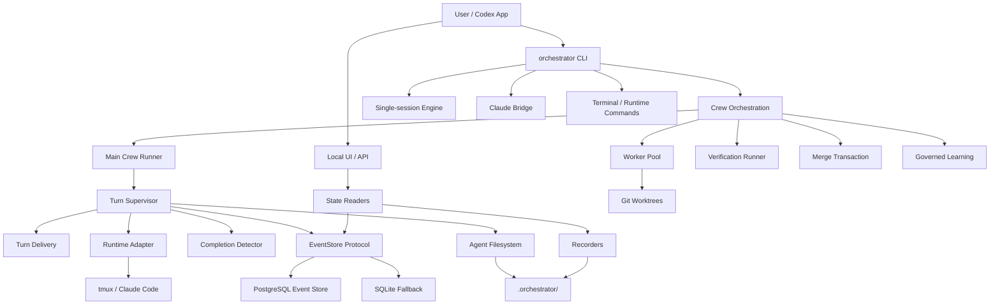
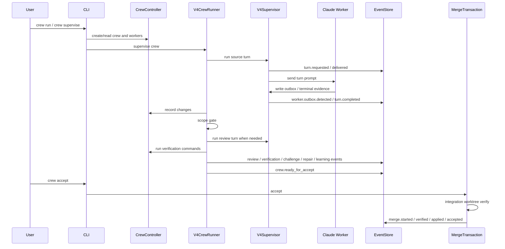

# Codex Claude Orchestrator 当前系统架构

Date: 2026-05-02

Status: Current working-tree architecture snapshot. This document describes the whole project as it currently exists, not only one runtime generation and not a future-only target.

## 1. 系统定位

Codex Claude Orchestrator 是一个本地优先的多代理编排系统。它的核心目标是让 Codex 作为监督者，把复杂开发任务拆给 Claude Code worker 执行，并用结构化状态、事件、验证、审查、合并事务和学习反馈来降低自动化开发的不确定性。

系统不是一个普通任务队列，也不是单纯的 tmux wrapper。它包含：

- 命令行控制面：创建、运行、监督、审查、验收 crew。
- Worker 运行时：启动 Claude Code worker、向 worker 投递 turn、收集 outbox 和终端证据。
- 状态系统：文件系统 artifact、crew/session/run recorder、PostgreSQL/SQLite event store。
- 安全门禁：write scope、review、verification、merge transaction、dirty-base protection。
- 学习反馈：challenge、repair、learning note、guardrail candidate、worker quality。
- UI/API：读取本地状态和 V4 event projection，提供观察界面。

## 2. 架构原则

当前系统按以下原则演进：

1. Codex 是最终监督者，worker 是可替换执行者。
2. Worker 输出必须转成结构化证据，不能只信任终端文本。
3. 状态必须可重放：事件流和 artifact 应解释系统为何进入某个状态。
4. 合并必须通过事务：先隔离验证，再进入用户主工作区。
5. 学习结果必须治理：记录 note/candidate/quality，但 guardrail/skill 不自动激活。
6. 兼容层可以存在，但主路径要逐步从兼容 artifact 迁到 typed event/artifact contract。

## 3. 顶层组件图



## 4. 代码包结构

| Package | 职责 |
| --- | --- |
| `cli.py` | CLI 命令入口和服务装配。 |
| `core/` | 基础模型、policy gate 等较早期核心能力。 |
| `session/` | 单会话任务执行、prompt 编译、session recorder、skill evolution。 |
| `bridge/` | Claude bridge 和 bridge supervisor loop。 |
| `crew/` | Crew 控制器、决策策略、旧 supervisor loop、task graph、readiness、review verdict。 |
| `workers/` | Worker pool、worker worktree、change recorder、worker selection。 |
| `workspace/` | Git workspace/worktree 管理。 |
| `runtime/` | tmux console、native Claude session、marker policy。 |
| `messaging/` | Worker inbox/message bus、protocol request store。 |
| `verification/` | 命令验证执行和结果评估。 |
| `state/` | Crew/session/run/blackboard recorder。 |
| `v4/` | 当前主链路的 event-native turn、outbox、event store、merge、learning、projection。 |
| `ui/` | 本地 HTTP UI/API 状态读取和渲染。 |
| `packs/` | 内置 capability / protocol pack registry。 |

## 5. 命令与控制面

主入口是 `orchestrator = codex_claude_orchestrator.cli:main`。

核心命令族：

- `crew start`: 创建 crew 和 worker。
- `crew run`: 创建并监督 crew；默认进入当前主链路。
- `crew supervise`: 对已有 crew 执行监督循环；默认进入当前主链路。
- `crew accept`: 对 worker patch 执行受保护合并事务。
- `crew events`: 从统一 EventStore 读取 crew event stream。
- `crew status / changes / verify / challenge / stop`: 读取或操作 crew 状态。
- `crew worker send`: 向 worker 发送消息。
- `ui`: 启动本地 UI。
- `claude bridge / term`: 管理 Claude bridge 和终端 session。

当前 `crew run` 和 `crew supervise` 默认使用 `V4CrewRunner`；只有显式 `--legacy-loop` 才进入旧 supervisor loop。`crew accept` 默认使用 `V4MergeTransaction`。

## 6. 当前主工作流



主循环的语义：

1. 找到或创建 source worker。
2. 向 worker 投递 structured turn。
3. 要求 worker 写出 outbox。
4. 从 outbox 和 runtime evidence 判断 turn completion。
5. 记录 worker changes。
6. 运行 write-scope gate。
7. 有改动时运行 review worker。
8. review block 或 verification failure 会发 challenge 和 repair request。
9. 重复 review block / verification failure 会生成 governed learning feedback。
10. 验证通过后标记 ready for accept。
11. accept 时先 integration worktree 验证，再应用主工作区。

## 7. Worker 模型

Worker 是带 contract 的 Claude Code 执行者。每个 worker 具有：

- `worker_id`
- role / label
- capabilities
- authority level
- write scope
- workspace path
- terminal pane
- transcript artifact
- contract id

Worker 由 `WorkerPool` 和 `WorktreeManager` 创建、复用和停止。当前 worker lifecycle 仍由 crew/controller 兼容层管理；event-native runtime 主要负责 turn delivery、completion、events 和 learning。

## 8. Runtime 与 turn contract

当前主要 runtime 是 tmux 承载的 Claude Code。

turn contract 由 `TurnEnvelope` 表达：

- crew id
- worker id
- turn id
- round id
- phase
- contract id
- message
- expected marker
- required outbox path
- unread inbox digest
- open protocol requests
- completion mode

`ClaudeCodeTmuxAdapter` 会把 turn 编译成 prompt，要求 worker 写出指定 outbox JSON。`watch_turn()` 当前先 poll `FilesystemRuntimeEventStream`：读取 required outbox、按 sha 去重、tail transcript cursor，再执行一次 tmux observe fallback。stream 的 sha/cursor 会在 supervisor 把 runtime evidence 追加到 EventStore 后再 commit，避免“cursor 已推进但事件未入库”的丢证据窗口。observe 失败只记录 `runtime.observe_failed` evidence，不会阻断已存在 outbox。

## 9. Outbox 与完成判定

worker outbox 是当前 worker turn 的主要结构化完成证据。

主要字段：

- `crew_id`
- `worker_id`
- `turn_id`
- `status`
- `summary`
- `changed_files`
- `artifact_refs`
- `verification`
- `acknowledged_message_ids`
- `messages`
- `risks`
- `next_suggested_action`

`CompletionDetector` 当前优先级：

1. valid outbox completed -> `turn.completed`
2. valid outbox failed -> `turn.failed`
3. valid outbox blocked/inconclusive -> `turn.inconclusive`
4. marker-only in structured mode -> `turn.inconclusive` with `missing_outbox`
5. process exit / timeout -> failed or timeout

因此当前主链路不再把 terminal marker 当作正常完成事实源。

## 10. 事件系统

V4 事件通过 `EventStore` protocol 写入和读取。后端：

- PostgreSQL：产品方向，支持远程 durable event store。
- SQLite：本地 fallback 和测试后端。
- EmptyEventStore：只读查询缺少 store 时的安全空实现。

`AgentEvent` 字段：

- `event_id`
- `stream_id`
- `sequence`
- `type`
- `crew_id`
- `worker_id`
- `turn_id`
- `round_id`
- `contract_id`
- `idempotency_key`
- `payload`
- `artifact_refs`
- `created_at`

重要事件族：

- Crew: `crew.started`, `crew.ready_for_accept`, `crew.accepted`, `human.required`
- Turn: `turn.requested`, `turn.delivered`, `worker.outbox.detected`, `turn.completed`, `turn.failed`, `turn.inconclusive`
- Review/verify: `review.completed`, `verification.passed`, `verification.failed`
- Repair: `challenge.issued`, `repair.requested`, `repair.completed`
- Learning: `learning.note_created`, `guardrail.candidate_created`, `worker.quality_updated`
- Merge: `merge.started`, `merge.verified`, `merge.applied`, `merge.blocked`
- Message: `message.read`, `message.ack_invalid`

## 11. Agent 文件系统

系统状态根目录：

```text
<repo>/.orchestrator/
```

主要内容：

```text
.orchestrator/
  crews/
    <crew_id>/
      crew.json
      workers/
      artifacts/
        workers/
        v4/
          workers/
            <worker_id>/
              inbox/
              outbox/
              patches/
              changes/
          merge/
          projections/
          learning/
  sessions/
  runs/
  v4/
    events.sqlite3
    integration/
```

当前 canonical V4 artifact path 由 `V4Paths` 生成，根为：

```text
.orchestrator/crews/<crew_id>/artifacts/v4/
```

注意：merge transaction 当前已安全化，merge input 现在优先来自 V4-native result/patch artifact contract；legacy `changes.json` / `diff.patch` 只作为没有 V4 result 事件时的兼容 fallback，并会留下 `merge.legacy_patch_source_used` evidence。

## 12. Messaging 与 protocol requests

`AgentMessageBus` 提供 worker inbox 读写。`TurnContextBuilder` 在 turn 前读取 unread inbox，但不会直接 mark read。

read cursor 的推进条件：

1. worker outbox valid。
2. outbox 包含 `acknowledged_message_ids`。
3. ack id 必须属于本 turn 的 delivered unread ids。
4. 系统 append `message.read`。
5. message bus 推进连续 read cursor。

`turn.delivered` 不等于 worker 已读，这是当前消息可靠性的关键边界。

## 13. Review、verification 与 readiness

Review 当前由具备 `review_patch` capability 的 worker 执行。review worker 通过 outbox summary 写出 parseable `CODEX_REVIEW` block，runner 将其解析为 `ReviewVerdict` 并追加 `review.completed`。

Verification 当前通过 `CrewVerificationRunner` 执行命令。失败会生成 `verification.failed`，并触发 challenge/repair。全部通过后写 `crew.ready_for_accept`。

当前 readiness 的硬条件：

- source turn completed with structured evidence
- write scope gate 通过或已处理
- review 未阻塞
- verification 全部通过
- 没有需要 human 的 blocking state

## 14. Merge 与 accept 安全

`crew accept` 走 `V4MergeTransaction`。

安全流程：

1. 优先读取 V4 `worker.result.recorded` 指向的 patch/result，缺失时 fallback 到 legacy worker patch。
2. 检查多 worker 同路径冲突。
3. 检查 patch paths 是否在 recorded changed files 内。
4. 检查所有 patch base ref 一致。
5. 检查 main workspace 无真实 dirty changes。
6. 检查 main HEAD 等于 patch base ref。
7. 创建 integration worktree。
8. `git apply --check` + apply。
9. 在 integration worktree 运行 final verification。
10. 重新检查 main dirty/base。
11. 在 main workspace `git apply --check` + apply。
12. 写 `merge.applied` / `crew.accepted`，停止 workers。

失败时写 `merge.blocked` 并返回 blocked。

## 15. Governed learning

当前 learning 分两层：

1. 记录层：LearningRecorder、GuardrailMemory、SkillCandidateGate、WorkerQualityTracker。
2. 主路径反馈层：GovernedLearningFeedback。

已接入主路径的反馈：

- 同一 crew/worker/category 下 2 次 `review_block` -> learning note + guardrail candidate + worker quality -2。
- 同一 crew/worker/category 下 2 次 `verification_failed` -> learning note + guardrail candidate + worker quality -3。

治理边界：

- guardrail candidate 默认 pending。
- skill/guardrail 不自动 approve。
- skill/guardrail 不自动 activate。
- deterministic gates 永远优先于学习结果。

当前缺口：planner 尚未消费 worker quality 和 learning projection。

## 16. UI/API

`ui/server.py` 提供本地 HTTP server。

主要能力：

- `/api/state` 聚合 repo、sessions、runs、skills、V4 event projection。
- `/api/sessions/<id>` 读取 session。
- `/api/runs/<id>` 读取 run。
- `/api/skills/<id>` 读取 skill。
- artifact endpoints 读取 run/session artifact。
- 首页渲染本地状态视图。

V4 UI state 通过 `build_v4_event_store(readonly=True).list_all()` 读取事件，再用 `CrewProjection` 聚合 crew 状态。

## 17. 安全边界

当前安全边界包括：

- Worker write scope gate。
- Worker contract authority level。
- Structured outbox validation。
- Message ack validation。
- Verification commands。
- Review worker 审查。
- Merge transaction dirty/base protection。
- Integration worktree final verification。
- Candidate approval/activation 分离。
- Artifact path safe id / safe read checks。

需要继续强化的边界：

- async filesystem subscription / runtime push stream 可继续降低延迟；同步 filesystem runtime event stream 已落地。
- legacy compatibility fallback 继续保留迁移边界，不再作为主事实源。
- planner 决策必须继续保持可解释和可重放。

## 18. 当前主要问题

当前问题清单中的 P1/P2 已关闭。

已关闭项：

- RepoIntelligence / PlannerPolicy 已接入：scope、package boundary、risk tag、suggested verification、worker quality 共同参与 source/review worker selection。
- Runtime watch 已接入 filesystem runtime event stream：outbox-first、outbox sha 去重、transcript 增量 evidence、事件入库后再推进 cursor/state，capture-pane 失败仅作为 evidence。
- V3 compatibility 已收敛：主命令默认 V4，legacy loop 显式，status 有 V4 events 时优先 projection，legacy artifacts 只作为 fallback。
- Review schema 已 typed：outbox `review` object 优先，summary parser 只作为 fallback。
- Worker reuse 已把 write scope compatibility 作为硬条件。
- EventStore 已有 schema/version health check，CLI 可通过 `crew event-store-health` 查询。
- Filesystem runtime event stream 已能去重 outbox、持久化 transcript cursor，并从 transcript delta 派生 runtime/marker evidence；state commit 发生在 EventStore append 之后。

后续增强不再作为当前 blocking issue：

- 更完整的 dependency graph / ownership inference。
- async filesystem subscription / runtime push stream。
- V4-native worker lifecycle service，进一步减少 `CrewController` substrate。

## 19. 推荐演进路线

1. 更完整的 dependency graph / ownership inference。
2. async filesystem subscription / runtime push stream。
3. V4-native worker lifecycle service。
4. 更细的 EventStore operational telemetry / migration automation。

## 20. 一句话总结

当前项目已经形成一条可用的多代理开发主链路：CLI 创建 crew，Codex 监督 Claude worker 产出 structured outbox，系统通过事件、review、verification、merge transaction、RepoIntelligence、planner、typed review、projection status 和 governed learning 管住自动化风险。当前问题清单已关闭，后续重点是把 V4 从稳定主路径继续演进成更完整的原生 runtime 服务层。
