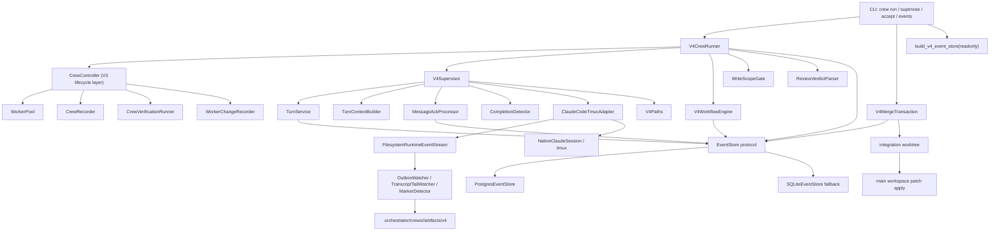
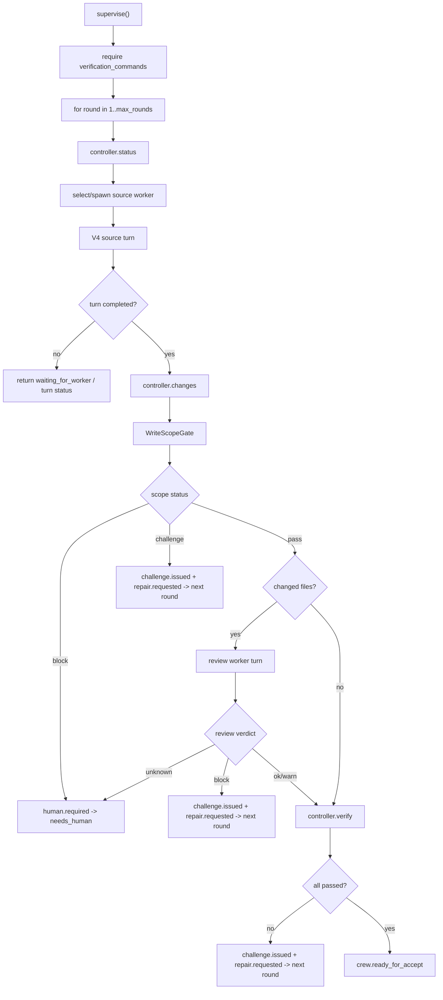

# V4 当前实现架构（落盘版）

Date: 2026-05-02

Source snapshot: `main@45469ff`

Status: Current implementation snapshot. This document describes what is currently implemented in the repository, not the full target architecture.

## 1. 文档目的

这份文档是 V4 当前落地状态的架构快照，用来回答三个问题：

1. 现在主命令到底走哪条路径。
2. worker turn、outbox、event store、review、repair、merge accept 目前如何串起来。
3. 哪些能力已经是主路径，哪些仍是兼容层或未完全闭环。

本文不把未来设计当作已经完成的事实。凡是还没有接进主调度闭环的能力，会明确标为 partial 或 pending。

## 2. 总体结论

当前系统已经从 V3 的 tmux marker polling 主循环，推进到 V4 的 event-native 主路径：

- `crew run` 默认进入 `V4CrewRunner`。
- `crew supervise` 默认进入 `V4CrewRunner`。
- `crew accept` 默认进入 `V4MergeTransaction`。
- `crew events` 通过统一 `build_v4_event_store()` 读取事件。
- `--legacy-loop` 保留 V3 supervisor loop 作为显式兼容路径。
- V4 turn completion 以 valid outbox 为主要完成证据；marker 在 structured-required 模式下只会导致 `turn.inconclusive/missing_outbox`，不是正常完成事实源。
- 事件存储抽象已经转成 `EventStore` protocol，PostgreSQL 是产品方向，SQLite 是 fallback/test/legacy 后端。

当前主路径可靠性缺口已经关闭，但仍可以继续向更完整的原生 runtime 服务层演进：

- runtime 仍由 tmux Claude session 承载，`watch_turn()` 已经接入 `FilesystemRuntimeEventStream`：先读 required outbox、按 sha 去重，再 tail transcript cursor；`capture-pane` 只是 fallback evidence。
- worker spawning、worktree lifecycle、changes 记录仍复用 V3 `CrewController`、`WorkerPool`、`CrewRecorder` substrate；用户主命令已经默认 V4。
- governed learning 已经接入 repeated review block / repeated verification failure 的反馈链路，会生成 learning note、guardrail candidate 和 worker quality update；worker quality 已进入 planner selection。
- review verdict 已支持 typed outbox `review` object；summary 文本块 parser 只作为 fallback。

## 3. 当前主架构图



## 4. 命令入口

### 4.1 `crew run`

Location: `src/codex_claude_orchestrator/cli.py`

默认路径：

```text
crew run -> build_v4_crew_runner(...) -> V4CrewRunner.run(...)
```

兼容路径：

```text
crew run --legacy-loop -> CrewSupervisorLoop.run(...)
```

动态 worker 模式：

```text
--spawn-policy dynamic --workers auto
```

会先调用 `controller.start_dynamic(...)` 创建 crew，再进入 `V4CrewRunner.supervise(dynamic=True)`。如果当前没有 source worker，runner 会调用 `CrewDecisionPolicy` 生成 source worker contract，然后通过 `controller.ensure_worker(...)` 创建 worker。

静态 worker 模式：

```text
--spawn-policy static
```

会先用 `WorkerSelectionPolicy` 选 worker role，再通过 `controller.start(...)` 创建 crew 和 worker，之后进入 V4 supervise。

### 4.2 `crew supervise`

默认路径：

```text
crew supervise -> build_v4_crew_runner(...) -> V4CrewRunner.supervise(...)
```

兼容路径：

```text
crew supervise --legacy-loop -> CrewSupervisorLoop.supervise(...)
crew supervise --legacy-loop --dynamic -> CrewSupervisorLoop.supervise_dynamic(...)
```

当前 V4 supervise 是同步循环，不是后台 daemon。它会按 round 执行 source turn、changes、scope gate、review、verification、challenge/repair，直到 ready、waiting、needs_human 或 max_rounds_exhausted。

### 4.3 `crew accept`

默认路径：

```text
crew accept -> build_v4_merge_transaction(...) -> V4MergeTransaction.accept(...)
```

它不再直接走 V3 `controller.accept()`。V4 accept 会先在 integration worktree 验证 patch，再重新检查 main workspace 的 dirty/base 状态，最后才把 patch 应用回主工作区。

### 4.4 `crew events`

默认路径：

```text
crew events -> build_v4_event_store(readonly=True) -> event_store.list_stream(crew_id)
```

它不再硬编码本地 `.orchestrator/v4/events.sqlite3`。具体后端由 `build_v4_event_store()` 决定。

## 5. 核心模块边界

| 模块 | 当前职责 | 状态 |
| --- | --- | --- |
| `cli.py` | 命令解析和 V4/V3 路由 | implemented |
| `v4/crew_runner.py` | V4 主调度循环，串联 source、review、repair、verify、ready | implemented |
| `v4/supervisor.py` | 单个 worker turn 的 event-native facade | implemented |
| `v4/turns.py` | turn request/delivery 事件、幂等 delivery claim | implemented |
| `v4/adapters/tmux_claude.py` | tmux Claude runtime adapter，发送 turn 并读取 outbox/output/marker 证据 | implemented |
| `v4/completion.py` | 从 runtime evidence 推导 terminal turn event | implemented |
| `v4/outbox.py` | worker outbox schema parse/validate | implemented |
| `v4/watchers.py` | raw evidence watchers | implemented |
| `v4/message_ack.py` | outbox acknowledged ids -> `message.read`/cursor advance | implemented |
| `v4/event_store_factory.py` | 统一 EventStore factory | implemented |
| `v4/postgres_event_store.py` | PostgreSQL event store | implemented |
| `v4/event_store.py` | SQLite fallback/test event store | implemented |
| `v4/merge_transaction.py` | accept merge transaction | implemented |
| `v4/paths.py` | V4 canonical artifact paths | implemented |
| `v4/projections.py` | event stream -> crew projection | implemented |
| `v4/learning_feedback.py` | repeated failure -> governed learning feedback | implemented |
| `v4/learning*.py` | learning projection / recorder / candidates | partial |
| `v4/adversarial.py` | adversarial challenge/evaluator primitives | partial |
| `crew/controller.py` | crew lifecycle、worker management、changes、verify legacy layer | still used |
| `crew/supervisor_loop.py` | V3 turn-based loop | legacy |

## 6. EventStore 架构

### 6.1 统一接口

V4 服务现在依赖 `EventStore` protocol，不应该直接依赖具体 SQLite class。核心方法：

- `append(...)`
- `append_claim(...)`
- `list_stream(stream_id, after_sequence=0)`
- `list_by_turn(turn_id)`
- `list_all()`
- `get_by_idempotency_key(idempotency_key)`

### 6.2 AgentEvent 字段

`AgentEvent` 当前字段：

```text
event_id
stream_id
sequence
type
crew_id
worker_id
turn_id
round_id
contract_id
idempotency_key
payload
artifact_refs
created_at
```

关键点：

- `stream_id` 通常等于 `crew_id`，用于 crew event stream。
- `sequence` 是 stream 内递增序号。
- `round_id` 和 `contract_id` 已经进入事件模型和 PG schema。
- `idempotency_key` 用于重复执行时返回既有事件，避免重复 delivery、重复 completion、重复 ready。

### 6.3 后端选择

`build_v4_event_store(repo_root, readonly=False)` 的行为：

```text
V4_EVENT_STORE_BACKEND=auto     -> 先尝试 PostgreSQL，配置不完整则 fallback SQLite
V4_EVENT_STORE_BACKEND=postgres -> 强制 PostgreSQL
V4_EVENT_STORE_BACKEND=pg       -> 强制 PostgreSQL
V4_EVENT_STORE_BACKEND=sqlite   -> 使用 legacy SQLite
```

PostgreSQL 配置来自环境变量：

```text
PG_HOST
PG_DB
PG_USER
PG_PASSWORD
PG_PORT
PG_ALLOW_DEFAULT_ENDPOINT
```

安全约束：

- `PG_PASSWORD` 必须由环境变量提供，本文档不记录任何密码。
- 如果使用代码内置 endpoint 默认值，必须设置 `PG_ALLOW_DEFAULT_ENDPOINT=1`。
- `readonly=True` 且 legacy SQLite 文件不存在时，会返回 `EmptyEventStore`，避免只读查询误创建状态文件。

### 6.4 PostgreSQL schema

当前 PG schema 主要表：

```text
event_store_schema_migrations
agent_events
```

`agent_events` 支持：

- 全局 `position BIGSERIAL`
- `event_id` primary key
- `stream_id + sequence` unique
- 非空 `idempotency_key` unique index
- `payload_jsonb`
- `artifact_refs_jsonb`
- `round_id`
- `contract_id`

PostgreSQL append 时会使用 `pg_advisory_xact_lock(hashtext(stream_id))` 保证同一 stream 的 sequence 分配稳定。

## 7. Agent 文件系统

### 7.1 canonical V4 artifact root

当前真正由 `V4Paths` 生成的 canonical V4 artifact root：

```text
<repo>/.orchestrator/crews/<crew_id>/artifacts/v4/
```

常见路径：

```text
.orchestrator/
  crews/
    <crew_id>/
      artifacts/
        v4/
          workers/
            <worker_id>/
              inbox/
              outbox/
                <turn_id>.json
              patches/
              changes/
          merge/
          projections/
          learning/
            notes/
            skill_candidates/
            guardrail_candidates/
            worker_quality.json
  v4/
    integration/
      <crew_id>/
        integration-<random>/
```

注意：`build_v4_crew_runner()` 构造 `ArtifactStore(repo_root / ".orchestrator" / "v4" / "artifacts")`，但 `V4Supervisor` 在传入 `repo_root` 后，turn outbox path 由 `V4Paths(repo_root, crew_id)` 决定。因此当前 V4 turn required outbox 的实际路径是 `.orchestrator/crews/<crew_id>/artifacts/v4/...`。

### 7.2 V3/V4 状态并存

当前还存在两类状态：

- V3 crew state: `.orchestrator/crews/<crew_id>/...`
- V4 events/artifacts: EventStore plus `.orchestrator/crews/<crew_id>/artifacts/v4/...`

V4 没有完全替换 `CrewRecorder`，因此 worker workspace、changes artifact、diff artifact、blackboard、protocol request 等仍有 V3 recorder 参与。

## 8. Worker turn 生命周期

### 8.1 Source turn

`V4CrewRunner.supervise()` 每轮会做：

```text
status -> source worker selection -> register worker -> run_source_turn
```

source worker 选择优先级：

1. `authority_level == source_write`
2. `role == implementer`
3. dynamic 模式下由 `CrewDecisionPolicy` spawn source worker

turn id 格式：

```text
round-<n>-<worker_id>-source
```

marker 格式：

```text
<<<CODEX_TURN_DONE crew=<crew_id> worker=<worker_id> phase=source round=<n>>> 
```

marker 仍会发送给 worker，但在 structured-required 模式下不是正常完成事实源。

### 8.2 Turn envelope

`V4Supervisor.run_worker_turn()` 会构造 `TurnEnvelope`，包含：

- crew id
- worker id
- turn id
- round id
- phase
- contract id
- message
- expected marker
- required outbox path
- unread inbox digest
- unread message ids
- open protocol requests
- completion mode
- structured result requirement

然后进入：

```text
TurnService.request_and_deliver(turn)
adapter.watch_turn(turn)
CompletionDetector.evaluate(turn, runtime_events)
```

### 8.3 Delivery 幂等

`TurnService` 会先检查已有事件：

- 已有 `turn.delivered`：直接返回 already delivered。
- 已有 `turn.delivery_failed`：直接返回 failed。

如果没有，才 append：

```text
turn.requested
turn.delivery_started
turn.delivered
```

或失败时：

```text
turn.requested
turn.delivery_started
turn.delivery_failed
```

`turn.delivery_started` 使用 `append_claim()`，配合 idempotency key 和进程内 lock，降低重复发送同一 turn 的风险。

### 8.4 tmux adapter

`ClaudeCodeTmuxAdapter.deliver_turn()` 会把 turn 编译成 prompt，并通过 `NativeClaudeSession.send(...)` 发到 worker 的 tmux pane。

prompt 里会强制写明：

- required outbox identity
- required outbox file path
- unread inbox digest
- open protocol requests
- 必须写出合法 outbox JSON

`watch_turn()` 当前顺序：

```text
1. poll FilesystemRuntimeEventStream without committing stream state yet
2. read required outbox and compare by sha
3. tail transcript from persisted offset and derive marker evidence
4. native_session.observe(capture-pane fallback)
5. emit output.chunk / marker.detected from tmux snapshot when available
6. supervisor appends runtime evidence to EventStore, then commits stream sha/cursor state
```

这修复了旧问题：即使 `capture-pane` observe 失败，只要 valid outbox 已经存在，supervisor 仍然能拿到 `worker.outbox.detected` 证据。

observe 失败时会产生 raw evidence：

```text
runtime.observe_failed
```

而不是直接把 turn 判失败。

## 9. Outbox contract

### 9.1 WorkerOutboxResult 字段

worker outbox JSON 当前应包含：

```json
{
  "crew_id": "crew-...",
  "worker_id": "worker-...",
  "turn_id": "round-1-worker-source",
  "status": "completed",
  "summary": "...",
  "changed_files": [],
  "artifact_refs": [],
  "verification": [],
  "acknowledged_message_ids": [],
  "messages": [],
  "risks": [],
  "next_suggested_action": ""
}
```

合法 status：

- `completed`
- `blocked`
- `failed`
- `inconclusive`

### 9.2 OutboxWatcher 输出

`OutboxWatcher` 读取 required outbox path，验证：

- JSON 可解析。
- required fields 存在。
- `crew_id` 匹配 watched crew。
- `worker_id` 匹配 watched worker。
- `turn_id` 匹配 watched turn。
- list 字段类型正确。
- status 在允许集合中。

然后产出 raw event：

```text
worker.outbox.detected
```

payload 当前包含：

- `valid`
- `status`
- `summary`
- `changed_files`
- `artifact_refs`
- `verification`
- `acknowledged_message_ids`
- `validation_errors`

当前限制：`messages`、`risks`、`next_suggested_action` 已在 parser model 中，但 watcher payload 尚未全部透传进 event payload。

### 9.3 Completion precedence

`CompletionDetector` 当前判定顺序：

1. valid outbox `status == completed` -> `turn.completed`
2. valid outbox `status == failed` -> `turn.failed`
3. valid outbox `status in {blocked, inconclusive}` -> `turn.inconclusive`
4. outbox status 缺失或非法 -> `turn.inconclusive`
5. marker detected 且 `structured_required` -> `turn.inconclusive`，reason 为 `missing_outbox`
6. marker detected 且 `completion_mode == marker_allowed` -> `turn.completed`
7. process exited -> `turn.failed`
8. deadline reached -> `turn.timeout`
9. 其他 -> `turn.inconclusive`

因此 V4 当前主路径已经不再把 terminal text marker 当作正常完成事实源。

## 10. Message bus 与 ack 闭环

### 10.1 Context 注入

`TurnContextBuilder` 每次 turn 前会读取 worker unread inbox：

```text
message_bus.read_inbox(crew_id, recipient=worker_id, mark_read=False)
```

它不会在投递时直接 mark read，而是构造：

- unread message ids
- unread inbox digest
- open protocol requests digest

这些被写入 `TurnEnvelope`，再由 adapter 注入 worker prompt。

### 10.2 Ack 处理

worker 在 outbox 中写：

```json
"acknowledged_message_ids": ["msg-1", "msg-2"]
```

`MessageAckProcessor` 只处理 valid `worker.outbox.detected` event。

处理步骤：

1. 从当前 turn 的 `turn.requested.payload.unread_message_ids` 找到本轮实际 delivered message ids。
2. outbox ack id 在 delivered ids 内：append `message.read`。
3. outbox ack id 不在 delivered ids 内：append `message.ack_invalid`。
4. 汇总该 worker 已 read 的 message ids。
5. 调用 `AgentMessageBus.advance_cursor_for_read_message_ids(...)` 推进 cursor。

关键设计点：

- `turn.delivered` 不等于 worker 已读。
- cursor 只在 outbox 明确 ack 并产生 `message.read` 后推进。
- ack 校验以本 turn delivered ids 为边界，避免 worker 伪 ack 未投递消息。

## 11. V4 supervise 主流程

当前 `V4CrewRunner.supervise()` 是产品主循环。



### 11.1 Scope gate

`WriteScopeGate` 对比：

- `controller.changes(...).changed_files`
- worker contract / worker record 中的 write scope
- evidence refs

结果：

- `pass`: 进入 review/verify。
- `challenge`: 写入 challenge + repair，下一轮让 source worker 修。
- `block`: `human.required`，返回 `needs_human`。

### 11.2 Review worker

只要 source worker 有 changed files，V4 runner 会尝试跑 review：

1. 找已有 `review_patch` capability worker，优先 label 为 `patch-risk-auditor`。
2. 没有则由 `CrewDecisionPolicy` spawn review worker。
3. 调用 `run_worker_turn(phase="review")`。
4. review worker 必须写 valid V4 outbox。
5. runner 从最新 `worker.outbox.detected.payload.summary` 解析 `<<<CODEX_REVIEW ... >>>`。
6. append `review.completed` event。

verdict 行为：

- `OK`: 继续 verification。
- `WARN`: 继续 verification，但保留 warning 信息在 event payload。
- `BLOCK`: append challenge/repair，下一轮 source worker 修。
- `unknown`: append `human.required`，返回 `needs_human`。

当前限制：

- review structured block 仍放在 outbox `summary` 文本中。
- `ReviewVerdict` 还不是 outbox schema 的 first-class typed field。

### 11.3 Verification

verification 仍通过 `CrewController.verify(...)` 和 `CrewVerificationRunner` 执行。

每个命令会追加：

```text
verification.passed
verification.failed
```

全部通过后：

```text
crew.ready_for_accept
```

有失败时：

```text
challenge.issued
repair.requested
```

并把最近 failures/repair requests 注入下一轮 source turn prompt。

## 12. Challenge、repair、learning

### 12.1 当前已经主路径化的部分

V4 runner 已经会在以下场景写 challenge/repair event：

- write scope challenge
- review block
- verification failed

事件：

```text
challenge.issued
repair.requested
```

`repair.requested.payload.worker_policy` 当前为：

```text
same_worker
```

也就是下一轮仍让原 source worker 修复。

V4 runner 还会把 repeated failure 接入 governed learning：

- 同一 `crew_id + worker_id + category` 下累计 2 次 `review_block`。
- 同一 `crew_id + worker_id + category` 下累计 2 次 `verification_failed`。

达到阈值后自动追加：

```text
learning.note_created
guardrail.candidate_created
worker.quality_updated
```

当前分值策略：

- repeated review block: `score_delta = -2`
- repeated verification failure: `score_delta = -3`

guardrail candidate 只会创建为 pending，不会自动 approve 或 activate。

### 12.2 当前 partial 的部分

以下能力已有模型或基础设施，但还没有完全进入主调度闭环：

- `AdversarialEvaluator`
- `ChallengeManager`
- `LearningRecorder`
- `LearningProjection`
- `SkillCandidateGate`
- `GuardrailMemory`
- `WorkerQualityTracker`

当前 `V4Supervisor` 支持注入 `adversarial_evaluator`，并在 `turn.completed` 后调用；但 CLI 默认构造 `V4Supervisor` 时没有注入 evaluator。

所以当前真实状态是：

- challenge/repair 已接入 V4 runner。
- repeated review/verification failure 已经能生成 learning note、guardrail candidate 和 worker quality update。
- governed learning 还没有成为自动 planner feedback loop。

## 13. Accept / merge transaction

`crew accept` 当前通过 `V4MergeTransaction.accept(...)`。

### 13.1 输入

必要输入：

- `crew_id`
- `summary`
- `verification_commands`

没有 verification command 会被 block：

```text
merge.blocked reason="verification command required"
```

### 13.2 Patch 收集

V4 runner 在 `controller.changes(...)` 后通过 `V4MergeInputRecorder` 记录 V4-native merge input：

```text
.orchestrator/crews/<crew_id>/artifacts/v4/workers/<worker_id>/patches/<turn_id>.patch
.orchestrator/crews/<crew_id>/artifacts/v4/workers/<worker_id>/results/<turn_id>.json
```

result manifest 包含：

- `worker_id`
- `turn_id`
- `round_id`
- `contract_id`
- `base_ref`
- `changed_files`
- `patch_artifact`
- `patch_sha256`
- `patch_paths`

同时写入：

- `worker.patch.recorded`
- `worker.result.recorded`

merge transaction 优先读取最新 `worker.result.recorded` 事件指向的 manifest/patch，并校验安全相对路径、patch 存在性、sha256、以及 manifest `patch_paths` 与实际 patch touches paths 是否一致。

只有没有任何 V4 result 事件时，才 fallback 到 legacy `CrewRecorder` `changes.json` / `diff.patch`，并写 `merge.legacy_patch_source_used` evidence。

### 13.3 Safety gates

accept 前 gates：

1. 至少存在 worker patch。
2. 多 worker 不能修改同一路径。
3. patch paths 必须是 recorded `changed_files` 子集。
4. 所有 patch 必须有同一个 `base_ref`。
5. main workspace 不能有真实未提交变更。
6. main HEAD 必须等于 worker patch base ref。

dirty check 会忽略 `.orchestrator` 状态目录，避免事件和 artifacts 自己阻塞 merge。

### 13.4 Integration worktree

通过后创建 integration worktree：

```text
.orchestrator/v4/integration/<crew_id>/integration-<random>/
```

流程：

```text
git worktree add --detach <integration_path> <base_ref>
git apply --check <combined_patch>
git apply <combined_patch>
run final verification commands in integration worktree
```

verification 全部通过后，再次检查：

- main workspace dirty
- main HEAD
- `git apply --check` against main

最后才：

```text
git apply <combined_patch> in main workspace
merge.applied
crew.accepted
CrewRecorder.finalize_crew(..., ACCEPTED)
controller.stop_workers_for_accept(...)
```

失败时统一 append：

```text
merge.blocked
```

并返回 `status: blocked`。

## 14. V3 兼容层

当前 V4 没有删除 V3，主要原因是 worker lifecycle 仍依赖 V3 层。

V3 仍负责：

- crew record layout
- worker spawning
- worker worktree creation
- tmux pane/session 管理
- changes artifact/diff artifact 记录
- verification runner
- blackboard/protocol request persistence

V4 负责：

- turn event model
- structured outbox completion
- delivery idempotency
- message ack loop
- V4 supervise orchestration
- review/repair events
- accept merge transaction

显式 legacy command：

```text
crew run --legacy-loop
crew supervise --legacy-loop
```

## 15. 事件类型速查

### Crew lifecycle

```text
crew.started
crew.ready_for_accept
crew.accepted
human.required
```

### Turn delivery / runtime

```text
turn.requested
turn.delivery_started
turn.delivered
turn.delivery_failed
worker.outbox.detected
runtime.observe_failed
output.chunk
runtime.output.appended
marker.detected
process.exited
runtime.process_exited
turn.deadline_reached
turn.completed
turn.failed
turn.inconclusive
turn.timeout
turn.cancelled
```

### Message ack

```text
message.read
message.ack_invalid
```

### Review / verification / repair

```text
review.completed
verification.passed
verification.failed
challenge.issued
repair.requested
```

### Merge

```text
merge.started
merge.verified
merge.applied
merge.blocked
```

## 16. Projections

`CrewProjection.from_events(events)` 当前可以从 event stream 推导：

- crew id
- goal
- crew status
- turn status map
- learning projection

status 推导规则：

- `crew.started` -> `running`
- `turn.*` -> 更新 turn projection，crew 保持 running
- `crew.ready_for_accept` -> `ready`
- `human.required` -> `needs_human`
- `crew.accepted` -> `accepted`
- learning projection 有 blocking challenge 且未 accepted -> `needs_human`

`crew status` 现在会先读取 V4 EventStore；如果 crew 有 V4 events，则返回 `CrewProjection.to_dict()`，并把 `runtime` 标为 `v4`。只有没有 V4 events 时才 fallback 到 `CrewController.status(...)`。

## 17. 当前可靠性改进点

已经落地的稳定性改进：

1. outbox-first watch：先读 required outbox，再 observe tmux。
2. marker-only 不再是 structured turn 的正常完成源。
3. watcher 只产 raw evidence，terminal decision 由 `CompletionDetector` 做。
4. delivery 和 terminal events 有 idempotency key。
5. message cursor 只在 explicit ack 后推进。
6. event store 支持 PG，且 schema 包含 `round_id` 和 `contract_id`。
7. accept 有 integration worktree、dirty-base protection、final verification。
8. main dirty check 忽略 orchestrator state，避免系统自身事件写入阻塞 accept。
9. repeated review block / verification failure 会进入 governed learning，但 guardrail activation 仍需审批。
10. merge input 优先来自 V4-native worker result/patch artifacts，legacy artifact 只作为有 evidence 的 fallback。
11. tmux adapter 主路径已接入 `FilesystemRuntimeEventStream`，outbox 事件按 sha 去重，transcript cursor 和 stream state 都可落盘恢复；stream state 只在 EventStore append 成功后推进。

## 18. 当前主要缺口

### 18.1 Runtime 仍不是异步事件唤醒

当前 tmux adapter 是：

```text
send turn -> initialize filesystem stream cursor -> watch_turn -> poll filesystem runtime stream -> observe capture-pane fallback
```

当前已具备 filesystem runtime stream 的恢复语义：stream state 会记录 outbox sha 和 transcript offset，新 adapter 实例可继续从上次 offset 读取，并避免重复上报同一 outbox。stream state 在 runtime evidence 入库后才 commit，避免 crash 时丢失未入库证据。`capture-pane` 仍保留为兼容 fallback；失败只产生 `runtime.observe_failed` evidence，不阻断 outbox 或 transcript evidence。

后续增强方向：

- filesystem watcher / async subscription。
- runtime process watcher。
- timeout watcher。
- supervisor 完全由事件唤醒，而不是同步 supervise 调用。

### 18.2 Planner / RepoIntelligence 已接入主路径

当前已经新增：

- `RepoIntelligence`：推断 write scope、package boundaries、risk tags、suggested verification commands。
- `PlannerPolicy`：基于 authority、capability、write scope、worker quality 选择 worker。
- `V4CrewRunner`：读取 learning projection，把 worker quality、active skill/guardrail refs、repo risk tags 输入 planner/decision policy。
- `CrewDecisionPolicy`：frontend risk tag 可触发 browser verification worker，不再只依赖 goal keyword。

后续增强方向：

- dependency graph
- package/module ownership
- reviewer confidence history

### 18.3 Worker reuse 的 scope 语义已成为硬条件

当前 `PlannerPolicy` 和 `WorkerPool.find_compatible_worker()` 都会比较 write scope compatibility。worker 仅 capability、authority、workspace mode 匹配但 write scope 不覆盖新 contract 时，不会被复用。

后续增强方向是把 contract compatibility 拓展到更完整的 ownership/risk model。

### 18.4 Review schema 已 typed

当前 outbox schema 支持 typed review：

```json
{
  "review": {
    "verdict": "ok",
    "summary": "...",
    "findings": [],
    "evidence_refs": []
  }
}
```

`OutboxWatcher` 会保留 typed review payload，`V4CrewRunner` 优先消费 typed review；summary 文本 parser 只作为 fallback。

### 18.5 Learning 已进入 planner 输入

当前已有 learning/adversarial 基础模型，主路径已经能在 repeated review block / repeated verification failure 后创建 note、guardrail candidate 和 worker quality update。`V4CrewRunner` 会读取 `LearningProjection`，worker quality 已影响 source/review worker selection，active skill/guardrail refs 已进入 planner snapshot。

后续增强方向是让 active skill/guardrail refs 进一步影响 prompt building 和 long-term planner memory。

### 18.6 CLI status 已 projection native

`crew events` 已走 V4 EventStore；`crew status` 现在有 V4 events 时优先返回 V4 projection，没有 V4 events 时才 fallback 到 V3 recorder/controller 状态。

## 19. 当前实现的失败恢复语义

### 19.1 Delivery 重试

如果同一 turn 已经有 `turn.delivered`，重复调用不会再次发送消息，而是返回 already delivered。

如果已有 `turn.delivery_failed`，重复调用返回 delivery failed。

如果只有 `turn.delivery_started` claim，但没有 delivered/failed，当前会返回：

```text
delivery already in progress
```

### 19.2 Completion 重放

`V4Supervisor._terminal_result()` 会先读该 turn 既有 terminal events：

- `turn.completed`
- `turn.failed`
- `turn.timeout`
- `turn.cancelled`

已有 terminal event 时直接返回，不再重新判断。

### 19.3 Observe 失败

observe 失败只产生 `runtime.observe_failed`，不会阻止已存在 outbox 被识别。

如果没有 outbox 且 observe 失败，completion detector 通常会进入 `turn.inconclusive`，runner 返回 `waiting_for_worker` 或对应 turn status。

### 19.4 Merge 失败

merge 任何 gate 失败都返回 `blocked` 并 append `merge.blocked`。

integration worktree 在 finally 中删除：

```text
git worktree remove --force <integration_path>
```

## 20. 测试覆盖快照

当前 V4 相关测试覆盖方向包括：

- event model / workflow
- EventStore protocol compatibility
- PostgreSQL event store config/schema behavior
- EventStore factory
- turn delivery idempotency
- outbox completion
- outbox-first tmux adapter watch
- transcript tail cursor watch
- filesystem runtime event stream
- EventStore schema/version health check
- message ack processor
- typed review outbox
- RepoIntelligence / PlannerPolicy
- V4 crew runner source/review/repair/verify path
- V4 merge transaction
- projection-native crew status
- CLI V4 route
- legacy crew tests

最近一次完整验证命令：

```text
pytest -q
```

结果快照：

```text
559 passed
```

## 21. 推荐下一步架构演进

优先级建议：

1. 将同步 filesystem runtime event stream 继续升级为 async filesystem subscription / runtime push stream。
2. 将 V3 worker lifecycle 逐步收敛成 V4 runtime/workspace service，而不是由 `CrewController` 混合承担。
3. 扩展 RepoIntelligence 到 dependency graph、ownership inference、reviewer confidence history。
4. 为 EventStore 增加更细的 operational telemetry、migration automation 和远程部署诊断。

## 22. 一句话定位

当前 V4 已经不是单纯 spec 雏形：主命令已经走 V4 runner、outbox completion、message ack、PG-capable event store、V4 merge transaction、V4-native merge artifacts、RepoIntelligence、PlannerPolicy、typed review、projection-native status，并且 repeated review/verification failure 已经能进入 governed learning feedback。它仍可继续演进为更完整的 V4-native lifecycle service，但当前问题清单里的主路径可靠性缺口已经关闭。
