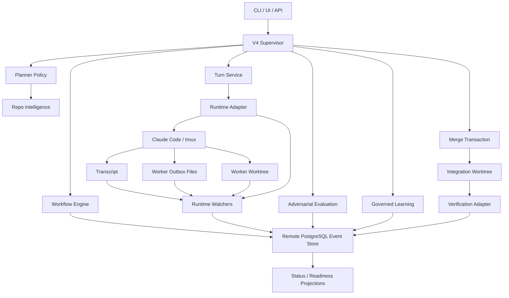

# V4 Event-Native Agent Filesystem Design

Date: 2026-05-02
Status: V4 foundation, structured outbox completion, message ack, event-store factory, guarded accept, default V4 run/supervise, repeated-failure governed learning feedback, V4-native merge artifacts, RepoIntelligence / PlannerPolicy, transcript cursor watch, typed review outbox, projection-native status, scope-compatible worker reuse, EventStore health checks, and filesystem runtime event stream have landed in the current working tree. Current P1/P2 issue list is closed; remaining work is product hardening such as async filesystem subscriptions and fuller V4-native lifecycle extraction.

## Purpose

V4 should become the main orchestration path for a stable, powerful multi-agent file-system runtime. The system should no longer treat tmux terminal output as the source of truth. Terminal output is useful evidence, but durable state must come from structured events in remote PostgreSQL, worker result files, message read acknowledgements, merge artifacts, and verification evidence.

The target shape is an event-native agent system:

- Codex is the supervisor and final decision maker.
- Claude Code workers are disposable subagents with explicit contracts.
- Each worker turn produces durable event evidence in PostgreSQL and structured filesystem artifacts under the repository's orchestrator state root.
- The project can recover after process restart by replaying V4 events from PostgreSQL and reading the agent filesystem.
- Codex-led adversarial evaluation remains a core product capability: Codex challenges weak worker outputs, requests repairs, verifies the repair, and records governed learning.
- Accepting work means applying worker changes through a verified merge transaction, not merely finalizing a crew record.

This design follows the direction of strong open-source agent-team systems:

- OpenHands style action-observation/event runtime: <https://docs.openhands.dev/sdk/arch/events>
- LangGraph style durable execution and checkpointing: <https://docs.langchain.com/oss/python/langgraph/durable-execution>
- pi-agentteam style shared task board, typed messaging, and event-driven wakeups: <https://pi.dev/packages/pi-agentteam>
- CrewAI separation of control flow and execution crews: <https://docs.crewai.com/en/introduction>
- AutoGen team patterns with explicit handoffs and team control loops: <https://microsoft.github.io/autogen/dev/user-guide/agentchat-user-guide/tutorial/teams.html>

The implementation should adapt these ideas to this repo instead of copying their abstractions directly.

## Original Problems Addressed

This design started from the following problems. The current main path has closed the P1/P2 items listed here; remaining work is product hardening such as async subscriptions, process watchers, and fuller V4-native lifecycle extraction.

1. Completion depends too much on tmux output and marker detection.
   `src/codex_claude_orchestrator/runtime/native_claude_session.py` still provides capture-pane fallback, but V4 structured turns now complete from valid outbox evidence, not marker-only terminal output.

2. V4's tmux adapter originally performed only a one-shot observe.
   `src/codex_claude_orchestrator/v4/adapters/tmux_claude.py` now polls `FilesystemRuntimeEventStream` first, which tails transcript/output, dedupes outbox by sha, and derives marker evidence before capture-pane fallback.

3. Dynamic decisions are rule-oriented.
   `src/codex_claude_orchestrator/crew/decision_policy.py` decides primarily from keywords, changed files, worker capabilities, and failure counts. It does not model dependency boundaries, test mapping, ownership, file risk, or worker quality history.

4. Worker reuse is under-constrained.
   `src/codex_claude_orchestrator/workers/pool.py` checks capability, authority, and workspace mode, but not strict write-scope compatibility or contract compatibility before reusing an active worker.

5. Message bus is not closed-loop.
   `src/codex_claude_orchestrator/messaging/message_bus.py` can store messages and read an inbox, but worker turns do not automatically include unread inbox digest, protocol requests, or delivery acknowledgements.

6. The V4 event schema is under-specified for the target workflow.
   Current V4 events do not yet carry first-class `round_id` and `contract_id` fields. The design needs an explicit schema versioning and migration path before these fields become required.

7. Merge and accept are too thin.
   `src/codex_claude_orchestrator/crew/merge_arbiter.py` only detects same-file conflicts. `CrewController.accept()` finalizes and stops workers without applying worker patches into an integration workspace and validating the result.

8. V4 is not yet the main CLI path.
   `src/codex_claude_orchestrator/cli.py` exposes V4 events, but normal crew run/supervision still leans on V3 controller behavior.

9. Adversarial learning exists, but is not integrated into V4.
   V2 sessions can create challenges and pending skills through `SessionEngine` and `SkillEvolution`, while V3 crews can challenge worker output. V4 needs a first-class event-native version of this loop so the main path keeps the original Codex-versus-worker learning behavior.

## Goals

- Make V4 the default orchestration path for `crew run`, `crew supervise`, `crew status`, `crew accept`, and event inspection.
- Replace marker-only completion with multi-source completion evidence.
- Introduce an agent filesystem where workers write structured outbox/result artifacts.
- Close the message bus loop so every worker turn includes unread inbox and open protocol requests, and message cursors advance only after explicit read acknowledgement.
- Make worker reuse safe by comparing contract compatibility, write scope, workspace mode, authority, and worker state.
- Add a merge transaction that applies worker changes into an integration worktree, validates write scope, resolves conflicts, and verifies the final workspace before accept.
- Protect the user's main workspace from clobbering dirty or diverged changes during accept.
- Make adversarial evaluation and governed learning a V4 first-class workflow, not a V2/V3 side path.
- Upgrade decision-making from simple routing rules to a planner that uses repo intelligence and risk signals.
- Preserve V3 compatibility while moving user-facing commands to V4.

## Non-Goals

- Do not build a general-purpose replacement for Claude Code.
- Do not require workers to run without tmux in the first V4 path. The runtime should support tmux as an adapter, but tmux should not be the source of truth.
- Do not remove V3 immediately. It remains a compatibility layer until V4 commands cover the required workflows.
- Do not commit database passwords or production secrets. PostgreSQL connection details come from environment variables or a secret provider.
- Do not make LLM-based planning the only safety layer. Deterministic gates remain mandatory for scope, merge, and verification.

## Implementation Alignment

The first V4 foundation implementation should be treated as the runtime substrate, not the full product loop. It covers the event-store protocol, PostgreSQL configuration, schema migration shape, canonical artifact paths, outbox schema, turn context delivery, watcher evidence events, and completion semantics.

This spec now adds one higher product layer that is not part of that foundation slice: adversarial evaluation and governed learning. That layer must be planned and implemented as a separate phase on top of the foundation. It should consume the same durable event evidence and artifacts rather than introducing a second state model.

The implementation plan must therefore stay explicit about phase ownership:

- Foundation phase: event store, agent filesystem, turn context, watcher evidence, completion detector, message ack semantics, and worker compatibility.
- Safety phase: merge transaction, dirty-base protection, verification adapters, and readiness projections.
- Adversarial phase: challenge/review/repair workflow, learning notes, pending skill and guardrail candidates, approval boundaries, and worker quality updates.
- Main-path phase: route CLI/UI workflows to V4 projections and keep V3 as an explicit legacy path.

## Architecture Overview



The main boundary is:

- Runtime adapters deliver turns and expose raw runtime signals.
- Watchers translate raw signals and filesystem artifacts into raw evidence events only.
- Completion and workflow components are the only writers of terminal turn-state events such as `turn.completed`, `turn.failed`, and `turn.timeout`.
- Adversarial evaluation reads completed-turn evidence and writes challenge/review/repair decisions as events.
- Governed learning converts repeated verified failures into learning notes, skill candidates, and guardrail candidates that require approval before becoming active.
- Workflow and projections decide state from events, not from live terminal state.
- Merge and accept operate on patches/artifacts and final verification evidence.

## Agent Filesystem

Each crew owns a durable local filesystem area under the existing recorder/artifact root. V4 should use one canonical physical root and resolve compatibility aliases through one path resolver.

Canonical physical roots:

- Repository state root: `<repo_root>/.orchestrator`
- Crew record root: `<repo_root>/.orchestrator/crews/<crew_id>`
- V4 agent artifact root: `<repo_root>/.orchestrator/crews/<crew_id>/artifacts/v4`
- Worker worktree root: `<repo_root>/.orchestrator/worktrees/<crew_id>/<worker_id>`
- V4 event store: remote PostgreSQL, not a local event database file

The V4 agent artifact root is the only place new V4 filesystem artifacts should be written. Existing V3 artifact paths may be read through compatibility resolvers, but new V4 modules must not independently choose `.codex`, `.orchestrator/v4`, or raw crew directories.

```text
<repo_root>/.orchestrator/crews/<crew_id>/artifacts/v4/
  manifest.json
  workers/
    <worker_id>/
      contract.json
      allocation.json
      onboarding_prompt.md
      transcript.txt
      inbox/
        <message_id>.json
      outbox/
        <turn_id>.json
      patches/
        <turn_id>.patch
      changes/
        <turn_id>.json
      logs/
        runtime.log
  learning/
    notes/
      <note_id>.json
    skill_candidates/
      <candidate_id>.json
    guardrail_candidates/
      <candidate_id>.json
    worker_quality.json
  messages/
    messages.jsonl
    cursors.json
    deliveries.jsonl
  merge/
    plan.json
    integration.patch
    conflicts.json
    verification.json
  projections/
    status.json
    readiness.json
```

Compatibility aliases:

- `workers/<worker_id>/...` without the `v4/` prefix refers to legacy V3 artifacts.
- `.codex/crew/<crew_id>/...` is documentation shorthand only and must not be used as a physical write path.
- All artifact references stored in events should be relative to the V4 agent artifact root unless explicitly marked as legacy.

## PostgreSQL Event Store

Remote PostgreSQL is the canonical event source for V4. The implementation should introduce an `EventStore` protocol and a `PostgresEventStore` production implementation. Any local or in-memory store may be used only for narrow unit tests through the same protocol.

Connection configuration:

```text
PG_HOST      default for this deployment: 124.222.58.173
PG_DB        default for this deployment: ragbase
PG_USER      default for this deployment: ragbase
PG_PORT      default for this deployment: 5432
PG_PASSWORD  required secret, no committed default
```

`PG_PASSWORD` must come from the environment or a secret provider. It must not be committed to code, docs, test fixtures, or default settings. The implementation may provide non-secret defaults for host, database, user, and port, but a missing password should fail fast with a clear configuration error.

Required tables:

```text
event_store_schema_migrations
  version
  checksum
  applied_at

agent_events
  event_id
  stream_id
  sequence
  type
  crew_id
  worker_id
  turn_id
  round_id
  contract_id
  idempotency_key
  payload_jsonb
  artifact_refs_jsonb
  created_at
```

Constraints and indexes:

- Unique `(stream_id, sequence)`.
- Unique non-empty `idempotency_key`.
- Indexes on `crew_id`, `worker_id`, `turn_id`, `round_id`, `contract_id`, and `created_at`.
- Appends use a transaction and row-level advisory or sequence locking per `stream_id`.

Schema versioning:

- Version `1` creates the base event table.
- Version `2` adds first-class `round_id` and `contract_id`.
- Migrations are append-only and recorded in `event_store_schema_migrations`.
- Event readers must tolerate absent optional fields during replay of older events.
- Once V4 becomes the main path, new events must always populate `round_id` and `contract_id` when the domain object exists.

## Event Model

V4 events are the durable control plane. Every event must have:

- `event_id`
- `stream_id`
- `type`
- `crew_id`
- optional `worker_id`
- optional `turn_id`
- optional `round_id`
- optional `contract_id`
- `payload`
- `artifact_refs`
- `created_at`
- `idempotency_key`

Core event families:

```text
crew.started
crew.status_changed
worker.spawn_requested
worker.spawned
worker.stopped
contract.created
contract.superseded
message.created
message.delivered
message.read
turn.requested
turn.delivery_started
turn.delivered
runtime.output.appended
runtime.process_exited
turn.deadline_reached
worker.outbox.detected
worker.patch.detected
marker.detected
turn.completed
turn.inconclusive
turn.failed
turn.timeout
review.requested
review.completed
challenge.issued
challenge.answered
repair.requested
repair.completed
verification.started
verification.passed
verification.failed
learning.note_created
skill.candidate_created
skill.approved
skill.rejected
skill.activated
guardrail.candidate_created
guardrail.approved
guardrail.rejected
guardrail.activated
worker.quality_updated
merge.planned
merge.started
merge.conflicted
merge.completed
crew.ready_for_accept
crew.accepted
human.required
```

Event replay must be sufficient to rebuild crew status, active workers, open turns, message cursors, readiness, and acceptability.

Event writer ownership:

```text
Watchers             -> raw evidence events only
CompletionDetector   -> turn.completed / turn.inconclusive / turn.failed / turn.timeout
WorkflowEngine       -> crew lifecycle, readiness, review.requested, human-required
MessageBus           -> message.created / message.delivered / message.read
AdversarialEvaluator -> review.completed / challenge.issued
ChallengeManager     -> challenge.answered / repair.requested / repair.completed
LearningRecorder     -> learning.note_created
SkillCandidateGate   -> skill.candidate_created / skill.approved / skill.rejected / skill.activated
GuardrailMemory      -> guardrail.candidate_created / guardrail.approved / guardrail.rejected / guardrail.activated
WorkerQualityTracker -> worker.quality_updated
MergeTransaction     -> merge.* and verification-linked merge evidence
VerificationAdapter  -> verification.started / verification.passed / verification.failed
```

## Runtime Watchers

The observe loop is now fronted by a watcher pipeline through `FilesystemRuntimeEventStream`. It still polls synchronously at first, but the state model is evidence ingestion, not "capture pane and decide." Watchers must not emit terminal turn-state decisions. Stream cursor/sha state advances only after runtime evidence has been durably appended to EventStore.

Watchers:

1. `TranscriptTailWatcher`
   Reads `transcript.txt` incrementally using byte offsets. Emits `runtime.output.appended` events. This avoids reprocessing the whole terminal snapshot.

2. `OutboxWatcher`
   Reads worker result files from `workers/<worker_id>/outbox/<turn_id>.json`. Emits `worker.outbox.detected` with schema validity, acknowledged message ids, and artifact refs. It does not emit `turn.completed` or `turn.inconclusive`.

3. `PatchWatcher`
   Detects patch/change summaries from worker worktree or explicit patch files. Emits `worker.patch.detected` and links changed-file artifacts.

4. `MarkerDetector`
   Detects expected marker in new transcript output. Emits `marker.detected`. Marker is completion evidence, not the only completion condition.

5. `ProcessWatcher`
   Detects process exit or missing tmux session. Emits `runtime.process_exited`. CompletionDetector decides whether that evidence becomes `turn.failed`.

6. `TimeoutWatcher`
   Checks turn deadline and emits `turn.deadline_reached`. CompletionDetector decides whether that evidence becomes `turn.timeout`.

Completion precedence:

1. Valid outbox result for the current `turn_id` wins.
2. For source-write turns, an expected marker without a valid outbox result becomes `turn.inconclusive` with reason `missing_outbox`.
3. For explicitly legacy/read-only turns that declare `completion_mode=marker_allowed`, an expected marker can complete the turn if no structured result is required.
4. Contract-level marker without turn-specific result is inconclusive.
5. Process exit before completion is failed.
6. Deadline reached before completion is timeout.
7. Any stale marker or quoted marker is ignored unless tied to the current turn.

## Worker Turn Protocol

Every worker turn should be delivered as a structured envelope. The human-readable prompt may remain markdown, but the content should be generated from a structured model.

Turn envelope fields:

```text
crew_id
worker_id
turn_id
round_id
phase
contract_id
message
expected_marker
required_outbox_path
allowed_write_scope
acceptance_criteria
unread_inbox_digest
open_protocol_requests
blackboard_highlights
deadline_at
attempt
```

Workers must be asked to produce a result file:

```json
{
  "crew_id": "crew-v4-runtime",
  "worker_id": "worker-source-1",
  "turn_id": "round-1-worker-source",
  "status": "completed",
  "summary": "Added transcript tail ingestion and outbox completion handling.",
  "changed_files": ["src/codex_claude_orchestrator/v4/watchers.py"],
  "verification": [
    {
      "command": ".venv/bin/python -m pytest tests/v4 -q",
      "status": "passed",
      "summary": "V4 test suite passed."
    }
  ],
  "acknowledged_message_ids": ["msg-review-request"],
  "messages": [],
  "risks": [],
  "next_suggested_action": "review"
}
```

If a worker cannot write the outbox file, it must report why in terminal output. The supervisor can then mark the turn inconclusive and decide whether to retry, repair the prompt, or require human input.

## Message Bus Closed Loop

The message bus should become a real delivery system rather than a passive log.

Changes:

- `AgentMessageBus.send()` still appends messages and emits `message.created`.
- A new `TurnContextBuilder` reads unread inbox messages for the target worker.
- `send_worker` / V4 turn delivery injects unread inbox digest and open protocol requests into the turn envelope.
- `turn.delivered` records delivery to the runtime but does not advance read cursors.
- Message cursors are advanced only after explicit `message.read` or a valid worker outbox result that acknowledges delivered message ids.
- Worker outbox can include responses or handoff messages. `OutboxWatcher` emits raw `worker.outbox.detected`; a message-ingestion service then validates embedded messages, appends them to the bus, and emits `message.created`.
- Delivery records should include `message_id`, `worker_id`, `turn_id`, and delivery event id.

This prevents the failure mode where messages exist in storage but the worker never sees them.

## Worker Lifecycle and Reuse

The default V4 behavior should follow the subagent-driven model:

- Fresh worker per implementation task.
- Separate fresh workers for spec review and code quality review.
- Read-only review or verification workers may be reused only when safe.

Reuse compatibility must check:

- Worker is active and healthy.
- Required capabilities are covered.
- Worker authority covers the requested authority.
- Workspace mode matches.
- Existing worker write scope covers the new contract write scope.
- Contract label/mission is compatible.
- Worker does not have blocking unread protocol requests.
- Worker worktree dirty state is compatible with the new task.
- Worker recent quality score is acceptable.

If any check fails, V4 spawns a new worker rather than reusing context.

## Planner and Repo Intelligence

`CrewDecisionPolicy` should evolve into a planner with deterministic guardrails.

Repo intelligence should provide:

- Changed files and ownership.
- Package/module boundaries.
- Import/dependency graph.
- Test mapping from source paths to likely test commands.
- File risk classification: config, migration, generated file, public API, docs, UI, backend, tests.
- Historical failure clusters.
- Worker quality history.

Planner actions:

- Spawn source worker.
- Spawn context scout.
- Spawn patch reviewer.
- Spawn verification worker.
- Spawn browser/e2e worker.
- Split task into subcontracts.
- Retry current worker with correction.
- Stop or quarantine worker.
- Request human input.
- Start merge transaction.
- Mark ready for accept.

Rules still exist as safety gates, but planning should be informed by repository structure and evidence.

## Adversarial Evaluation and Governed Learning

Codex-led adversarial evaluation is a core V4 capability. V4 must not become only a durable worker runtime; it should preserve the original demand-side loop where Codex challenges Claude Code output, requires repair, verifies the repair, and turns repeated lessons into governed learning.

The adversarial loop consumes durable evidence:

- worker outbox result
- changed-file and patch artifacts
- review verdicts
- verification output
- write-scope gate results
- message acknowledgements
- historical failure clusters
- worker quality history

It produces event-native decisions:

```text
turn.completed
  -> adversarial.evaluate
  -> review.completed | challenge.issued
  -> repair.requested
  -> repair turn
  -> verification.passed | verification.failed
  -> learning.note_created
  -> skill.candidate_created | guardrail.candidate_created
  -> skill.approved | skill.rejected | guardrail.approved | guardrail.rejected
  -> skill.activated | guardrail.activated
```

Adversarial evaluators should look for:

- missing or weak verification evidence
- missing regression tests
- claims in outbox that are not backed by artifacts
- write-scope or policy risk
- public API, migration, generated-file, or config risk
- repeated failure classes
- worker ignoring delivered messages or protocol requests
- review `BLOCK` or unresolved `WARN` findings

The module boundaries are:

- `AdversarialEvaluator` inspects evidence and emits `challenge.issued` or `review.completed` with a pass/block verdict.
- `ChallengeManager` records challenge state and builds the repair turn context.
- `RepairPlanner` asks the planner whether to retry the same worker, spawn a fresh worker, or require human input.
- `LearningRecorder` writes learning notes only after a challenge is verified by repair or final failure evidence.
- `SkillCandidateGate` creates pending skill candidates; skills do not become active without explicit approval and activation.
- `GuardrailMemory` records narrow guardrail candidates tied to evidence refs.
- `WorkerQualityTracker` updates quality history from accepted work, blocked reviews, repeated repair loops, and ignored protocol messages.

Adversarial and learning event payloads must be explicit enough for replay:

```text
challenge.issued
  challenge_id
  source_turn_id
  source_event_ids
  severity: warn | block
  category
  finding
  required_response
  repair_allowed
  artifact_refs

challenge.answered
  challenge_id
  answer_turn_id
  status: acknowledged | disputed | blocked
  summary
  evidence_event_ids

repair.requested
  challenge_id
  repair_contract_id
  repair_turn_id
  worker_policy: same_worker | fresh_worker | human_required
  allowed_write_scope
  acceptance_criteria
  required_outbox_path

repair.completed
  challenge_id
  repair_turn_id
  outcome: fixed | not_fixed | blocked | inconclusive
  verification_event_ids
  changed_files

learning.note_created
  note_id
  source_challenge_ids
  source_event_ids
  failure_class
  lesson
  trigger_conditions
  scope

skill.candidate_created
  candidate_id
  source_note_ids
  source_event_ids
  proposed_name
  proposed_body_ref
  trigger_conditions
  activation_state: pending
  approval_required: true

guardrail.candidate_created
  candidate_id
  source_note_ids
  source_event_ids
  rule_summary
  enforcement_point
  trigger_conditions
  activation_state: pending
  approval_required: true

skill.approved | skill.rejected | guardrail.approved | guardrail.rejected
  candidate_id
  decision
  decision_reason
  approver
  decided_at

skill.activated | guardrail.activated
  candidate_id
  activation_id
  activated_by
  activated_at
  active_artifact_ref
  rollback_plan

worker.quality_updated
  worker_id
  score_delta
  reason_codes
  source_event_ids
  expires_at
```

Governed learning constraints:

- No learning artifact may bypass deterministic gates.
- A pending skill or guardrail must include source event ids, challenge ids, artifact refs, trigger conditions, and verification evidence.
- `skill.approved` and `guardrail.approved` record approval decisions only; they do not change runtime behavior by themselves.
- `skill.activated` and `guardrail.activated` are the only events that make a learned artifact active in planning, prompting, or gating.
- Active behavior changes require approval through the existing skill approval model or explicit V4 approval and activation events.
- Learning from failed or inconclusive turns must stay narrow; broad policy changes require human review.
- Worker quality history can influence planning and reuse, but cannot override write-scope, merge, or verification gates.

## Merge and Accept Transaction

Accepting a crew must become a transaction.

Transaction stages:

1. Collect worker changes.
   Read worker changes artifacts, patch files, worktree diffs, and declared changed files.

2. Validate scope.
   Every changed path must be allowed by the worker's contract write scope. Out-of-scope changes block merge.

3. Build merge plan.
   Detect same-file conflicts, dependency conflicts, API/test conflicts, generated-file conflicts, migration/config conflicts, and overlapping ownership.

4. Create integration worktree.
   Apply accepted worker patches in deterministic order from a recorded base ref and base tree hash.

5. Run targeted verification.
   Use repo intelligence and worker-provided verification evidence to choose commands.

6. Run final verification.
   Run the final required command set on the integrated workspace, not inside a worker's private worktree.

7. Record merge evidence.
   Write merge plan, patch, conflict summary, verification result, and changed files under `merge/`.

8. Update main workspace.
   Apply the verified integration result to the user's workspace only after the transaction passes and dirty-base protection succeeds.

9. Accept crew.
   Emit `crew.accepted`, finalize projections, and stop workers.

If any step fails, emit a blocking event and leave worker worktrees intact for inspection.

Dirty-base protection before updating the main workspace:

- Record `base_ref`, `base_commit`, and `base_tree_hash` when the crew or merge transaction starts.
- Before applying the integration result, compare the user's current `HEAD`, index, and worktree against the recorded base.
- If `HEAD` moved, rebase or replay the integration patch onto the current `HEAD` in a fresh integration worktree and rerun final verification.
- If the user has dirty files that overlap the integration patch, block accept and emit `human.required`.
- If dirty files are unrelated, either preserve them with a checked patch apply or block according to a conservative `dirty_base_policy`.
- Never overwrite a user-modified file in the main workspace without an explicit clean base check.

## CLI and UI Migration

V4 should become the default behavior:

```text
crew run          -> V4 supervisor
crew supervise    -> V4 workflow loop
crew status       -> V4 projections
crew events       -> V4 event store
crew worker send  -> V4 turn delivery
crew worker tail  -> V4 transcript/artifact tail
crew accept       -> V4 merge transaction
```

V3 remains accessible through explicit legacy paths or compatibility adapters. The CLI should avoid presenting V3 and V4 as two equally primary systems.

## Error Handling

The system should fail into inspectable states.

- Missing marker: inconclusive unless outbox result is valid.
- Missing outbox: inconclusive, then retry or human-required depending on attempts.
- Stale marker: ignored if not tied to the current turn.
- Worker process exit: failed if no completion evidence exists.
- Delivery conflict: existing `turn.delivery_started` prevents duplicate sends.
- Message delivery failure: cursor is not advanced.
- Runtime delivery without worker acknowledgement: cursor is not advanced.
- Challenge unresolved: merge and accept are blocked.
- Skill or guardrail candidate pending approval: it is recorded but not active.
- Skill or guardrail approved but not activated: it remains visible in projections but is not injected into prompts, planner scoring, or deterministic gates.
- Scope violation: merge blocked.
- Verification failure: merge blocked and planner receives failure evidence.
- Dirty or diverged main workspace: accept is blocked or integration is replayed in a fresh worktree before final verification.
- Event store duplicate: idempotency key returns existing event.

## Testing Strategy

Unit tests:

- Event append idempotency.
- Projection rebuild from events.
- Transcript tail offset handling.
- Outbox schema validation.
- Watchers emit only raw evidence events, never terminal turn decisions.
- Marker detection ignores stale markers.
- Marker-only source-write completion becomes inconclusive without outbox.
- Message cursor advances only after read acknowledgement.
- Worker reuse rejects incompatible write scope.
- Adversarial evaluator issues challenge for missing verification evidence.
- Learning recorder creates pending skill/guardrail candidates only with evidence refs.
- Skill/guardrail approval and activation are separate replay states.
- Planner and prompt builders ignore approved-but-not-activated candidates.
- Worker quality history updates from verified challenge outcomes.
- Merge arbiter detects scope and dependency conflicts.
- Merge transaction blocks dirty-base clobbering.
- Completion detector precedence.

Integration tests:

- Turn completes through outbox without marker.
- Source-write turn with marker but no outbox becomes inconclusive.
- Read-only legacy turn with marker and `completion_mode=marker_allowed` can complete.
- Turn fails on process exit without completion.
- Restart and replay resumes waiting turn without duplicate delivery.
- Worker message round-trip appears in next turn context.
- Challenge/repair loop runs from event evidence without relying on terminal output as truth.
- Verified repair creates a learning note and pending skill candidate without activating it automatically.
- Accept applies patch in integration worktree and verifies before finalization.
- Accept refuses to overwrite dirty user files that overlap the integration patch.

Regression tests:

- Existing V4 tests keep passing.
- Existing V3 CLI compatibility tests keep passing until the command is intentionally migrated.

Target verification after implementation:

```text
.venv/bin/python -m pytest tests/v4 -q
.venv/bin/python -m pytest tests/messaging tests/workers tests/crew -q
.venv/bin/python -m pytest tests/cli/test_cli.py tests/ui/test_server.py -q
.venv/bin/python -m pytest -q
```

## Rollout Plan

Phase 1: V4 protocol foundation

- Add PostgreSQL event store protocol and schema migrations.
- Add turn context builder.
- Add outbox result schema.
- Add message delivery/read events.
- Add worker compatibility checks.

Phase 2: Watcher pipeline

- Add transcript tail watcher.
- Add outbox watcher.
- Add marker detector as event source.
- Add process/timeout events.
- Update V4 supervisor so watchers emit evidence and CompletionDetector owns terminal turn decisions.

Phase 3: Merge transaction

- Add patch collection.
- Add write-scope validation.
- Add integration worktree.
- Add final verification adapter.
- Add dirty-base protection before main workspace update.
- Make accept depend on merge transaction.

Phase 4: Adversarial evaluation and governed learning

- Add adversarial evaluator over completed-turn evidence.
- Add challenge manager and repair turn workflow.
- Add learning recorder with pending skill and guardrail candidates.
- Add explicit payload schemas and projections for challenge, repair, learning, approval, and activation states.
- Add worker quality history updates.
- Keep skill and guardrail activation behind approval.

Phase 5: V4 main path

- Route primary CLI commands to V4.
- Keep legacy commands explicit.
- Update UI status from V4 projections.

Phase 6: Planner upgrade

- Add repo intelligence.
- Add test mapping.
- Add risk scoring.
- Add worker quality history.
- Upgrade planner actions.

## Acceptance Criteria

- A worker can complete a turn by writing a valid outbox result even if it never prints the marker.
- A missing marker cannot leave the crew permanently stuck in `waiting_for_worker` when valid structured evidence exists.
- A marker alone cannot complete a source-write turn that requires an outbox result.
- Watchers never emit terminal turn-state events.
- The next worker turn always includes unread inbox digest and open protocol requests.
- Message cursors are not advanced before explicit read acknowledgement.
- A worker with incompatible write scope is not reused.
- V4 can issue a challenge from structured evidence, request a repair turn, verify the repair, and create a pending learning artifact without auto-activating it.
- V4 replay distinguishes pending, approved, rejected, and activated learning artifacts.
- Approved-but-not-activated learning artifacts cannot affect planner choices, prompts, deterministic gates, or worker reuse.
- Accept cannot finalize without a successful merge transaction and final verification in an integration workspace.
- Accept cannot clobber dirty or diverged main-workspace changes.
- V4 event replay can reconstruct crew status and readiness.
- V4 event replay reads from remote PostgreSQL with schema migration/version checks.
- CLI primary crew flow uses V4 supervisor and projections.
- Full test suite passes.

## Risks and Mitigations

Risk: Worker fails to write the required outbox file.

Mitigation: Keep marker detection and transcript evidence as fallback, but classify the turn as inconclusive after bounded retries.

Risk: More event types make projections more complex.

Mitigation: Keep event schemas narrow, add projection tests, and treat projections as derived state that can be rebuilt.

Risk: Merge transaction may be slow for small tasks.

Mitigation: Use targeted verification first, but keep final verification mandatory before accept.

Risk: V3 compatibility becomes confusing.

Mitigation: Make V4 the default CLI path and name V3 access explicitly as legacy.

Risk: Planner becomes overfit to rules.

Mitigation: Separate deterministic safety gates from repo intelligence and planner scoring. Safety gates block dangerous actions; planner chooses useful next actions.

Risk: Learning artifacts pollute future behavior.

Mitigation: Treat learning notes, skill candidates, and guardrail candidates as governed artifacts. They must cite source events and remain pending until approved. Deterministic gates always override learned behavior.
